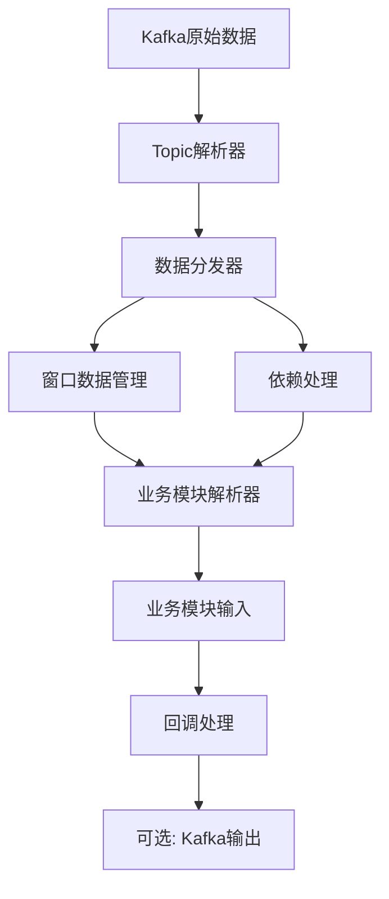

# 开发者指南

本文档为data_analysis模块的开发者提供详细的架构说明、扩展指南和性能优化建议。

## 目录

1. [架构设计说明](#架构设计说明)
2. [扩展指南](#扩展指南)
3. [性能考虑](#性能考虑)
4. [测试指南](#测试指南)

## 架构设计说明

### 整体架构

data_analysis模块采用分层架构设计，主要包括以下层次：

```
+-----------------------+
|       业务应用层       |
+-----------------------+
|       数据解析层       |
+-----------------------+
|       数据分发层       |
+-----------------------+
|       Kafka连接层       |
+-----------------------+
```

### 核心组件

1. **DataAnalysisService/AsyncDataAnalysisService**
   - 主服务类，负责协调整个数据解析流程
   - 管理Kafka连接、数据分发和回调处理
   - 提供同步和异步两种API接口

2. **DataDispatcher**
   - 数据分发与依赖处理核心
   - 管理多场站数据窗口缓存
   - 处理模块间依赖关系
   - 支持数据补全/插值策略

3. **ParserBase**
   - 解析器基类，定义统一接口
   - 各topic解析器和业务模块解析器均继承此类

4. **Topic解析器 (topic_parsers/)**
   - 负责解析各topic的原始数据
   - 将原始数据转换为结构化格式

5. **业务模块解析器 (parsers/)**
   - 整合多topic数据，生成业务模块所需输入
   - 处理模块间依赖关系

6. **Kafka客户端**
   - KafkaConsumerClient/KafkaProducerClient: 同步Kafka客户端
   - AsyncKafkaConsumerClient/AsyncKafkaProducerClient: 异步Kafka客户端

### 数据流向

1. 从Kafka消费原始数据
2. 使用topic解析器解析原始数据
3. DataDispatcher缓存和管理窗口数据
4. 根据业务需求整合多topic数据
5. 处理模块间依赖关系
6. 通过业务模块解析器生成最终输入
7. 可选：将结果上传到Kafka供下游消费

### 系统流程图



## 扩展指南

### 添加新的Topic解析器

1. 在`data_analysis/topic_parsers/`目录下创建新的解析器类
2. 继承`ParserBase`基类，实现`parse`方法
3. 在`dispatcher.py`中的`TOPIC_PARSER_MAP`添加映射关系

示例：

```python
# data_analysis/topic_parsers/new_topic_parser.py
from .parser_base import ParserBase

class NewTopicParser(ParserBase):
    def parse(self, raw_data):
        """
        解析新topic的原始数据
        :param raw_data: dict, 原始数据
        :return: dict, 解析后的结构化数据
        """
        # 实现解析逻辑
        parsed_data = {
            # 解析后的字段
        }
        return parsed_data
```

然后在`dispatcher.py`中添加映射：

```python
TOPIC_PARSER_MAP = {
    # 其他映射...
    "NEW-TOPIC": NewTopicParser(),
}
```

### 添加新的业务模块解析器

1. 在`data_analysis/parsers/`目录下创建新的解析器类
2. 继承`ParserBase`基类，实现`parse`方法
3. 在`DataDispatcher`的初始化中添加新解析器
4. 在`config.py`中添加模块依赖关系（如需要）

示例：

```python
# data_analysis/parsers/new_module_parser.py
from .parser_base import ParserBase

class NewModuleParser(ParserBase):
    def parse(self, input_data):
        """
        解析新业务模块的输入数据
        :param input_data: dict, 包含多topic数据和依赖模块数据
        :return: dict, 模块所需的输入结构
        """
        # 实现解析逻辑
        module_input = {
            # 模块输入结构
        }
        return module_input
```

然后在`DataDispatcher.__init__`中添加：

```python
def __init__(self, data_expire_seconds=600):
    self.parsers = {
        # 其他解析器...
        "new_module": NewModuleParser(),
    }
    # 其他初始化代码...
```

并在`config.py`中添加模块依赖：

```python
MODULE_DEPENDENCIES = {
    # 其他依赖...
    "new_module": ["dependency1", "dependency2"],
}
```

### 修改数据窗口和补全策略

1. 在`config.py`中修改topic的`window_size`
2. 在`DataDispatcher`中设置补全策略

补全策略包括：
- 'zero': 补零（默认）- 适合累计值或计数类数据
- 'linear': 线性插值 - 适合连续变化的物理量（温度、功率等）
- 'forward': 前向填充 - 适合状态数据或缓慢变化的量
- 'missing': 标记为None - 适合需要明确区分缺失数据的场景

示例：

```python
# 设置补全策略
dispatcher = DataDispatcher()
dispatcher.set_padding_strategy("linear")  # 使用线性插值

# 也可以在初始化服务时指定
service = DataAnalysisService(
    kafka_config=KAFKA_CONFIG,
    topic_detail=TOPIC_DETAIL,
    module_name="load_prediction",
    stations=["station1", "station2"],
    padding_strategy="linear"  # 指定补全策略
)
```

### 配置最佳实践

#### Kafka配置优化

**开发环境配置**:
```python
KAFKA_CONFIG = {
    'consumer': {
        'bootstrap_servers': ['localhost:9092'],
        'group_id': 'data_analysis_dev',
        'auto_offset_reset': 'earliest',  # 开发时从头消费
        'enable_auto_commit': True,
        'max_poll_records': 100,  # 开发环境可以减少
    },
    'producer': {
        'bootstrap_servers': ['localhost:9092'],
        'acks': '1',  # 开发环境可以降低要求
        'retries': 1,
        'compression_type': 'none',  # 开发环境可以不压缩
    }
}
```

**生产环境配置**:
```python
KAFKA_CONFIG = {
    'consumer': {
        'bootstrap_servers': ['kafka1:9092', 'kafka2:9092', 'kafka3:9092'],
        'group_id': 'data_analysis_prod',
        'auto_offset_reset': 'latest',
        'enable_auto_commit': True,
        'max_poll_records': 500,
        'session_timeout_ms': 30000,
        'request_timeout_ms': 40000,
        'heartbeat_interval_ms': 3000,
        'max_poll_interval_ms': 300000,
    },
    'producer': {
        'bootstrap_servers': ['kafka1:9092', 'kafka2:9092', 'kafka3:9092'],
        'acks': 'all',  # 生产环境必须保证可靠性
        'retries': 3,
        'max_in_flight_requests_per_connection': 5,
        'compression_type': 'gzip',  # 启用压缩
        'linger_ms': 10,
        'batch_size': 16384,
        'buffer_memory': 33554432,
    }
}
```

**配置说明**:
- 开发环境注重便利性和调试能力
- 生产环境注重可靠性、性能和容错能力
- 使用多个broker地址提高高可用性
- 合理配置超时参数避免频繁重连

#### 窗口大小配置建议

根据数据特点选择合适的窗口大小：

```python
TOPIC_DETAIL = {
    'REAL-STATION-DATA': {
        'window_size': 5,  # 高频数据(每分钟)，5分钟窗口
        # ...
    },
    'SCHEDULE-STATION-PARAM': {
        'window_size': 1,  # 低频配置数据，1个即可
        # ...
    },
    'STORAGE-DATA': {
        'window_size': 10,  # 需要历史趋势分析，10个数据点
        # ...
    },
}
```

**原则**:
- 高频数据：窗口大小 = 所需时间范围 / 数据间隔
- 低频数据：通常1-2个数据点即可
- 需要趋势分析：适当增加窗口大小
- 内存限制：窗口过大会增加内存消耗，需权衡

## 性能考虑

### 系统性能瓶颈

1. **Kafka消费/生产速度**：高频数据可能导致Kafka成为瓶颈
2. **内存使用**：大量场站和历史数据缓存可能导致内存压力
3. **CPU使用**：数据解析和补全策略计算可能消耗较多CPU资源
4. **网络IO**：跨模块数据依赖可能导致网络传输开销

### 大规模部署注意事项

1. **分区策略**：
   - 根据场站数量合理设置Kafka分区
   - 确保分区负载均衡，避免热点分区

2. **内存管理**：
   - 设置合理的数据过期时间
   - 定期清理过期数据
   - 监控内存使用，必要时增加系统资源

3. **并发处理**：
   - 同步服务：调整线程池大小
   - 异步服务：合理配置事件循环并发数

4. **数据压缩**：
   - 使用Kafka消息压缩减少网络传输开销
   - 对历史数据进行压缩存储

### 资源使用优化建议

1. **窗口大小优化**：
   - 根据业务需求设置最小必要的窗口大小
   - 避免不必要的历史数据存储

2. **批处理优化**：
   - 对于高频数据，考虑适当降低处理频率
   - 实现批处理回调，减少单条数据处理开销

3. **缓存策略**：
   - 对频繁访问的数据进行缓存
   - 实现LRU等缓存淘汰策略

4. **异步IO**：
   - 使用异步Kafka客户端提高IO效率
   - 避免阻塞IO操作

## 测试指南

### 单元测试编写规范

1. 测试文件命名：`test_*.py`
2. 测试类命名：`Test*`
3. 测试方法命名：`test_*`
4. 使用断言验证预期结果

示例：

```python
import unittest
from data_analysis import DataAnalysisService

class TestDataAnalysisService(unittest.TestCase):
    def setUp(self):
        # 测试初始化
        self.service = DataAnalysisService()

    def test_service_initialization(self):
        # 测试服务初始化
        self.assertIsNotNone(self.service)
        self.assertEqual(self.service.module_name, None)

    def tearDown(self):
        # 测试清理
        if self.service:
            self.service.stop()
```

### 集成测试方法

1. 使用测试Kafka集群（如Docker部署的Kafka）
2. 创建测试topic和数据
3. 验证数据解析和分发流程
4. 验证模块间依赖关系

示例：

```python
import unittest
import json
from data_analysis import DataAnalysisService

class TestIntegration(unittest.TestCase):
    @classmethod
    def setUpClass(cls):
        # 设置测试Kafka环境
        pass

    def test_data_flow(self):
        # 测试完整数据流
        callback_called = False

        def test_callback(station_id, module_input):
            nonlocal callback_called
            callback_called = True
            self.assertEqual(station_id, "test_station")
            self.assertIn("some_field", module_input)

        service = DataAnalysisService()
        service.start(callback=test_callback)

        # 模拟Kafka消息
        test_msg = {
            "station_id": "test_station",
            "some_field": "test_value"
        }
        # 这里应将消息发送到测试Kafka topic

        # 等待处理
        import time
        time.sleep(3)

        self.assertTrue(callback_called)
        service.stop()
```

### 性能测试指南

1. 使用`timeit`或`time`模块测量关键操作耗时
2. 使用`memory_profiler`监控内存使用
3. 使用`psutil`监控系统资源

示例：

```python
import time
import statistics
from data_analysis import DataAnalysisService

def test_performance():
    service = DataAnalysisService()

    # 测量多次运行的平均时间
    times = []
    for _ in range(10):
        start = time.time()
        # 执行要测试的操作
        service.get_all_outputs("test_station")
        end = time.time()
        times.append(end - start)

    avg_time = statistics.mean(times)
    print(f"平均处理时间: {avg_time:.4f}秒")

    service.stop()
```
