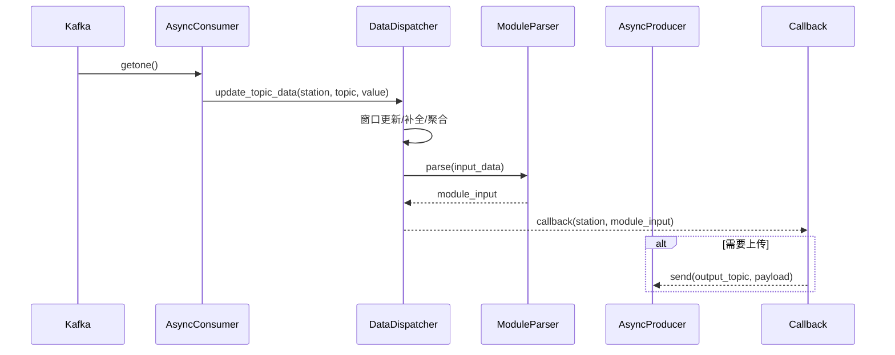

# 算法设计说明书（Data Analysis Module）

更新时间：2025-10-23  |  版本：v1.0

## 1. 概述

### 1.1 目标问题概述

本模块用于电力/能源场站多源数据的实时解析与分发，面向多业务模型（如负荷预测、价格评估、热管理、运营优化等）提供统一、稳健、可扩展的数据输入。系统从Kafka消费多Topic数据，进行窗口缓存、缺失补全与插值、跨模块依赖聚合，并以同步或异步方式将解析后的输入分发给业务模块或回调函数，可选将输出回传至Kafka供下游消费。

### 1.2 设计动因

- 多Topic异构数据：频率各异、字段不齐、存在缺失与乱序
- 多模块依赖：模块输入既依赖多Topic，也依赖其他模块的输出
- 高并发与多场站：需在资源可控下支持大量场站同时处理
- 可靠性与可观测性：稳定运行、可恢复、易监控与追踪
- 统一接口与低侵入：业务模块只关注“所需输入”，不关心数据清洗与治理细节

### 1.3 设计目标

- 可嵌入/可独立：既可作为库被模型集成，也可独立部署
- 同步/异步双栈：线程池同步处理与asyncio全链路异步处理
- 可插拔解析：Topic解析器和业务模块解析器均可扩展
- 完整的窗口管理与补全：支持 zero/linear/forward/missing 策略
- 高可用Kafka连接：重试、超时、生产者上传与消费者重连
- 健康监控与错误隔离：统一异常捕获与恢复，不拖垮主流程

## 2. 算法描述

### 2.1 运行流程

1. Kafka消费：按配置订阅多个Topic，获取原始消息
2. Topic解析：将原始消息解析为结构化字段
3. 窗口管理：按Topic配置维护固定大小窗口（deque）
4. 窗口补全/插值：对不足窗口的数据按策略进行 zero/linear/forward/missing 处理
5. 依赖聚合：根据模块依赖，从其他模块递归获取所需字段
6. 模块解析：调用业务模块解析器，将窗口字段整合为模块输入结构
7. 回调与输出：将模块输入交由回调处理，或将结果上传Kafka
8. 清理与过期：定期清理过期窗口数据，维护内存与一致性

Mermaid时序图（异步主流程）：



### 2.2 核心数据结构与处理

- 多场站缓存：data_cache = {station_id: {topic: deque[(raw, ts)]}}
- Topic→字段聚合：解析器输出dict，按字段聚合成 window 与 latest 值
- 补全策略：
  - zero：数值型前补0；非数值亦用0
  - linear：使用 numpy.interp 进行线性插值；非数值退化为前补首值
  - forward：前向填充首值
  - missing：使用 None 表示缺失
- 依赖聚合：MODULE_DEPENDENCIES 显式声明，get_module_input 递归合并

### 2.3 主要模块/类

<a id="sec-2-3"></a>
#### 快速导航（2.3 主要模块/类）
- [2.3.1 DataDispatcher](#sec-2-3-1)
- [2.3.2 DataAnalysisService（同步）](#sec-2-3-2)
- [2.3.3 AsyncDataAnalysisService（异步）](#sec-2-3-3)
- [2.3.4 Kafka 客户端（同步/异步）](#sec-2-3-4)
- [2.3.5 异常类与回调契约](#sec-2-3-5)

本节合并了完整的接口与参数说明，涵盖构造参数、方法、返回与异常，来源于项目源代码解析与API文档校对。

<a id="sec-2-3-1"></a>
#### 2.3.1 DataDispatcher（数据分发与依赖处理核心）

构造：
```
DataDispatcher(data_expire_seconds: int = 600)
```
- data_expire_seconds：窗口数据过期时间（秒），默认600

关键属性：
- data_cache：{station_id: {topic: deque[(raw, ts)]}}
- padding_strategy：'zero' | 'linear' | 'forward' | 'missing'（默认'zero'）

方法：
- set_padding_strategy(strategy: str) -> None
  - 设置窗口补全策略（'zero'/'linear'/'forward'/'missing'）
- update_topic_data(station_id: str, topic: str, raw_data: dict) -> None
  - 将原始数据入队到对应窗口；异常以 DispatcherError 记录并隔离
- get_topic_window(station_id: str, topic: str) -> list
  - 返回按时间顺序的 data 列表
- get_module_input(station_id: str, module: str) -> dict | None
  - 解析窗口+补全+字段聚合+依赖聚合后返回模块输入；异常记录并返回 None
- get_all_outputs(station_id: str) -> dict
  - 返回所有业务模块的输入结构 {module: input}
- clean_expired() -> None
  - 清理过期窗口数据；若场站窗口全空则整体移除
- reload_config(config_mod) -> None
  - 热更新 Topic/窗口/依赖配置

补全策略说明：
- zero：前补0（非数值也使用0）
- linear：数值序列使用 numpy.interp 线性插值；非数值退化为前补首值
- forward：前向填充首值
- missing：使用 None 表示缺失

<a id="sec-2-3-2"></a>
#### 2.3.2 DataAnalysisService（同步服务）

构造：
```
DataAnalysisService(
  module_name: str | None = None,
  topics: list[str] | None = None,
  kafka_config: dict | None = None,
  data_expire_seconds: int = 600,
  output_topic_prefix: str = "MODULE-OUTPUT-",
)
```
要点：
- topics 默认来自配置中的所有 Topic
- 若提供 module_name，则输出Topic为 f"{prefix}{module_name.upper()}"

方法：
- start(callback: callable | None = None, background: bool = True) -> None
  - 后台线程或前台阻塞运行主循环
  - 回调签名：callback(station_id: str, module_input: dict) -> Any
  - 回调异常被捕获并记录；返回非 None 时优先作为上传内容
- stop() -> None
  - 停止主循环、关闭Kafka、回收线程池
- get_outputs(station_id: str) -> dict
  - 返回当前缓存下的所有模块输入
- reload_config() -> None
  - 重新加载 config.py 并通知 dispatcher 热更新
- get_station_status() -> dict
  - {station_id: {running: bool, future: Future}}
- get_service_status() -> dict
  - {main_thread_alive, consumer_alive, producer_alive, station_count}

异常：KafkaConnectionError（初始化/发送/消费失败时）

<a id="sec-2-3-3"></a>
#### 2.3.3 AsyncDataAnalysisService（异步服务）

构造参数与同步版本一致；内部以 asyncio 实现场站 Task 并发。

方法：
- await start(callback: callable | None = None) -> None
- await stop() -> None
- get_outputs(station_id: str) -> dict
- await add_station(station_id: str, callback: callable) -> None
- await remove_station(station_id: str) -> None
- get_station_status() -> dict（{station_id: {running: bool, task: asyncio.Task}}）

回调支持同步或异步函数；当返回值非 None 时优先上传该结果，否则上传 module_input。

<a id="sec-2-3-4"></a>
#### 2.3.4 Kafka 客户端（同步/异步）

兼容配置：支持嵌套与扁平读取 bootstrap_servers 与常用参数（子配置优先，回退顶层）。

- KafkaConsumerClient(topics: list[str], config: dict, max_retries: int = 5, retry_interval: int = 5)
  - poll(timeout_ms: int = 1000) -> dict[TopicPartition, list[Message]]
  - close() -> None
  - 行为：重试连接；value 以 JSON 反序列化为 dict

- KafkaProducerClient(config: dict, max_retries: int = 5, retry_interval: int = 5)
  - send(topic: str, value: dict) -> None（内部 flush）
  - close() -> None
  - 行为：失败重试，最终抛出异常

- AsyncKafkaConsumerClient(topics: list[str], config: dict, loop=None)
  - await start() -> None
  - await getone() -> Message（未启动将抛出明确错误）
  - await stop() -> None

- AsyncKafkaProducerClient(config: dict, loop=None)
  - await start() -> None
  - await send(topic: str, value: dict) -> None（send_and_wait；未启动将抛出明确错误）
  - await stop() -> None

参数透传白名单：
- 消费者（同步 kafka-python）：group_id, auto_offset_reset, enable_auto_commit, max_poll_records, session_timeout_ms, request_timeout_ms, heartbeat_interval_ms, max_poll_interval_ms, security_protocol, sasl_mechanism, sasl_plain_username, sasl_plain_password, ssl_cafile, ssl_certfile, ssl_keyfile
- 生产者（同步 kafka-python）：acks, retries, compression_type, linger_ms, batch_size, max_in_flight_requests_per_connection, buffer_memory, security_protocol, sasl_mechanism, sasl_plain_username, sasl_plain_password, ssl_cafile, ssl_certfile, ssl_keyfile
- 异步（aiokafka）消费者/生产者：security_protocol, sasl_mechanism, sasl_plain_username, sasl_plain_password

<a id="sec-2-3-5"></a>
#### 2.3.5 异常类与回调契约（摘要）

异常：
- DataAnalysisError：数据契约不满足（非 dict/缺 ID）
- KafkaConnectionError：连接/消费/发送失败
- DispatcherError：窗口/解析/依赖异常

回调契约：
```
def callback(station_id: str, module_input: dict) -> Any
async def callback(station_id: str, module_input: dict) -> Any
```
返回值将作为上传内容；返回 None 时上传 module_input。

### 2.4 输入与输出

- 输入：
  - Kafka消息（多Topic），每条至少包含 station_id/host_id/meter_id 之一
  - 配置：
    - KAFKA_CONFIG（支持嵌套与扁平；见附录A）
    - TOPIC_DETAIL（fields, window_size 等）
    - MODULE_DEPENDENCIES（模块依赖）
- 输出：
  - get_module_input(station, module) → dict
  - get_all_outputs(station) → {module: dict}
  - 可选：Callback返回值或Kafka上传数据，统一包含 station_id、output、timestamp

### 2.5 开发与运行环境

- 语言：Python 3.9+
- 依赖：kafka-python、aiokafka、numpy、pytest、python-docx（仅用于文档导出脚本）
- 运行：Linux/Windows；Kafka 2.2+

## 3. 算法契约（Inputs/Outputs/Errors）

- 输入契约：
  - Kafka消息为JSON可反序列化为dict
  - 包含 station_id/host_id/meter_id 至少一个，用于路由
  - Topic在 TOPIC_DETAIL 中有配置（window_size≥1）
- 输出契约：
  - 模块输入包含“字段窗口后缀 _window”与“最新值字段”
  - 对缺失与不足窗口，遵循 padding_strategy 约定
- 错误模式：
  - Kafka连接失败：重试+错误上报，不阻塞主流程
  - 解析异常/依赖缺失：记录日志并返回None/降级输出
  - 回调异常：捕获并隔离，不影响其他场站与主循环

## 4. 性能标准与验收标准

### 4.1 性能标准（建议值，可按规模调优）

- 吞吐量：单实例每秒处理消息数≥N（与分区数与CPU相关，按部署SLA设定）
- 端到端延迟：95分位 ≤ 1s（异步链路，消息到模块输入）
- 内存占用：受 window_size 与场站数线性增长，常态<1GB（按配置评估）
- 重连恢复：Kafka短暂故障恢复≤30s，无数据丢失（acks=all 前提）

### 4.2 验收标准（必达项）

- 功能验收：
  - 多Topic消息正确聚合为模块输入
  - 四种补全策略符合定义与示例
  - 依赖模块聚合字段正确、无循环死锁
  - 同步与异步服务均可运行，支持回调与Kafka上传
- 稳定性验收：
  - Kafka断连/异常自动恢复，主循环不中断
  - 过期清理正确回收窗口数据，无内存泄露
- 兼容性验收：
  - KAFKA_CONFIG 支持嵌套与扁平两种格式
  - Windows/Linux 环境可运行（tests 全通过）

## 5. 关键算法细节与边界场景

- 空窗口：返回 None 或按策略填充（missing→全None）
- 非数值线性插值：退化为前补首值，避免异常
- 递归依赖：深度优先安全合并，异常隔离并日志记录
- 乱序与重复：以到达顺序进入窗口，业务可结合timestamp在解析器层处理
- 大窗口/高频：建议压缩与批量配置（producer linger_ms/batch_size）

## 6. 监控与可观测性

- 日志：模块化日志，错误统一 handle_error(context)
- 指标（可选）：处理总量、错误计数、内存使用、处理耗时直方图
- 健康检查：/health 提供基本存活信息

## 7. 安全与可用性

- Kafka生产：acks=all + retries≥3，降低丢失风险
- 配置热更新：DataDispatcher.reload_config 动态刷新窗口/依赖
- 线程/协程隔离：场站级线程/Task，局部异常不扩散

## 8. 附录

### 附录A：Kafka配置示例（嵌套/扁平，兼容）

- 嵌套（推荐）：
```python
KAFKA_CONFIG = {
    'consumer': {
        'bootstrap_servers': ['kafka1:9092', 'kafka2:9092'],
        'group_id': 'data_analysis',
        'auto_offset_reset': 'latest',
        'enable_auto_commit': True,
        'max_poll_records': 500,
    },
    'producer': {
        'bootstrap_servers': ['kafka1:9092', 'kafka2:9092'],
        'acks': 'all',
        'retries': 3,
        'compression_type': 'gzip',
    }
}
```
- 扁平（向后兼容）：
```python
KAFKA_CONFIG = {
    'bootstrap_servers': ['kafka1:9092', 'kafka2:9092'],
    'group_id': 'data_analysis',
    'auto_offset_reset': 'latest',
    'enable_auto_commit': True,
}
```

注意：当前实现要求顶层存在 bootstrap_servers；若仅在嵌套中声明，需确保代码已更新为同时兼容两种声明方式。

### 附录B：Topic配置与窗口

```python
TOPIC_DETAIL = {
  'SCHEDULE-STATION-PARAM': {
    'fields': ['station_id', 'lat', 'lng', ...],
    'window_size': 1
  },
  'SCHEDULE-STATION-REALTIME-DATA': {
    'fields': ['p', 'q', 'soc', ...],
    'window_size': 5
  },
  # ...
}
```

### 附录C：模块依赖示例

```python
MODULE_DEPENDENCIES = {
    'electricity_price': ['pv_prediction', 'evaluation_model', 'SOH_model'],
    'station_guidance': ['load_prediction', 'evaluation_model'],
    'thermal_management': ['load_prediction', 'operation_optimization'],
    'operation_optimization': ['load_prediction'],
}
```

### 附录D：错误分类与恢复策略

- KafkaConnectionError：连接/发送/消费失败 → 指数退避重试+报警
- DispatcherError：窗口/解析/依赖异常 → 记录并跳过，定期清理
- DataAnalysisError：数据契约不满足（非dict/缺ID）→ 记录并忽略

### 附录E：开发与测试

- 单元测试：见 tests/*，包含极端场景与集成路径
- 性能压测：可用本地Kafka + 造数器，观测吞吐与延迟
- 部署：参考 DEPLOYMENT.md（容器化/K8s例子）

---

本说明书对应代码主分支 main，细节以仓库内 API.md / DEVELOPER.md / DEPLOYMENT.md 为准。

<!-- 原第9节API参考内容已合并至 2.3 主要模块/类，避免重复。 -->