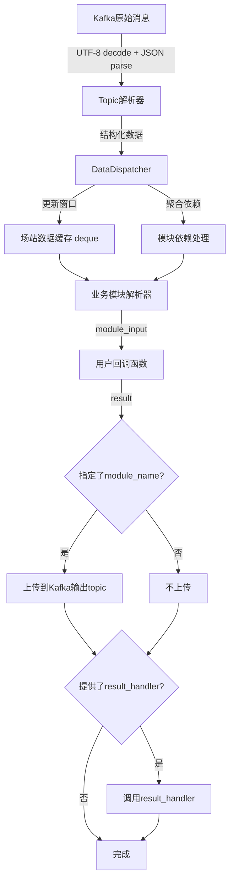

# 开发者指南

> **文档版本**：v1.1  
> **更新日期**：2025-11-07  
> **对应代码版本**：data_analysis v1.1 (branch: feature-one)

本文档为data_analysis模块的开发者提供详细的架构说明、扩展指南和性能优化建议。

**修订说明**：
- v1.1 (2025-11-07): 更新以匹配实际开发需求
  - 更正架构组件描述以反映实际实现
  - 更新Topic和Module解析器添加流程
  - 移除未实现的padding策略相关内容
  - 更新Kafka配置最佳实践
  - 补充实际的测试用例位置和使用方法
  - 添加项目结构说明

## 目录

1. [架构设计说明](#架构设计说明)
2. [扩展指南](#扩展指南)
3. [性能考虑](#性能考虑)
4. [测试指南](#测试指南)

## 架构设计说明

### 整体架构

data_analysis模块采用分层架构设计，核心包名为 `d_a`，主要包括以下层次：

```
+---------------------------+
|      业务应用层           |  (用户回调函数)
+---------------------------+
|      服务协调层           |  (DataAnalysisService / AsyncDataAnalysisService)
+---------------------------+
|      数据分发层           |  (DataDispatcher - 窗口管理、依赖处理)
+---------------------------+
|      解析器层             |  (TopicParser / ModuleParser)
+---------------------------+
|      Kafka连接层          |  (KafkaConsumerClient / KafkaProducerClient)
+---------------------------+
```

**项目结构**：
```
d_a/
├── __init__.py                 # 包初始化，导出公共API
├── analysis_service.py         # 同步和异步服务主类
├── dispatcher.py               # 数据分发器（核心路由逻辑）
├── kafka_client.py             # Kafka客户端封装
├── config.py                   # 配置文件（Kafka、Topic、依赖）
├── errors.py                   # 异常定义和错误处理
├── parser_base.py              # 解析器基类
├── main.py                     # 命令行入口（可选）
├── doc/                        # 文档目录
│   ├── API.md
│   ├── DEPLOYMENT.md
│   ├── DEVELOPER.md
│   └── ALGORITHM_DESIGN_SPEC.md
├── topic_parsers/              # Topic解析器
│   ├── __init__.py
│   ├── station_param.py        # SCHEDULE-STATION-PARAM
│   ├── station_realtime_data.py # REAL-STATION-DATA
│   ├── device_gun.py           # DEVICE-GUN-DATA
│   ├── device_storage.py       # STORAGE-DATA
│   ├── car_order.py            # CAR-ORDER-DATA
│   ├── car_price.py            # CAR-PRICE-DATA
│   ├── device_error.py         # DEVICE-ERROR-DATA
│   ├── device_host.py          # DEVICE-HOST-DATA
│   ├── device_meter.py         # METER-DATA
│   ├── environment_calendar.py # ENV-CALENDAR-DATA
│   └── model_output.py         # MODULE-OUTPUT-*（通用）
└── parsers/                    # 业务模块解析器
    ├── __init__.py
    ├── load_prediction_parser.py
    ├── pv_prediction_parser.py
    ├── evaluation_model_parser.py
    ├── SOH_model_parser.py
    ├── electricity_price_parser.py
    ├── operation_optimization_parser.py
    ├── station_guidance_parser.py
    ├── thermal_management_parser.py
    └── customer_mining_parser.py
```

### 核心组件

1. **DataAnalysisService / AsyncDataAnalysisService** (`analysis_service.py`)
   - 主服务类，负责协调整个数据解析流程
   - 管理Kafka消费者/生产者生命周期
   - 维护DataDispatcher实例
   - 处理多场站并发（同步使用ThreadPoolExecutor，异步使用asyncio.Task）
   - 提供健康检查和配置热更新API

2. **DataDispatcher** (`dispatcher.py`)
   - 数据分发与依赖处理核心
   - 管理多场站数据窗口缓存（使用 `deque` 和 `RLock`）
   - 调用TopicParser解析原始数据
   - 调用ModuleParser整合多topic数据
   - 处理模块间依赖关系（递归聚合）
   - 自动清理过期数据

3. **ParserBase** (`parser_base.py`)
   - 解析器抽象基类，定义统一接口 `parse(data)`
   - 所有topic解析器和业务模块解析器均继承此类

4. **Topic解析器** (`topic_parsers/`)
   - 负责解析各topic的Kafka原始消息（JSON）
   - 将原始数据转换为结构化格式
   - 提取关键字段（如 `stationId`, `timestamp` 等，注意使用camelCase）
   - 11个topic解析器对应11个数据源

5. **业务模块解析器** (`parsers/`)
   - 整合多topic窗口数据，生成业务模块所需输入
   - 处理模块间依赖关系（从 `MODULE_DEPENDENCIES` 读取）
   - 9个业务模块解析器对应9个算法模块

6. **Kafka客户端** (`kafka_client.py`)
   - `KafkaConsumerClient` / `KafkaProducerClient`: 同步Kafka客户端（基于kafka-python）
   - `AsyncKafkaConsumerClient` / `AsyncKafkaProducerClient`: 异步Kafka客户端（基于aiokafka）
   - 支持嵌套和扁平两种配置格式
   - 参数白名单校验，自动过滤不支持的参数
   - JSON序列化/反序列化，UTF-8编码

7. **错误处理** (`errors.py`)
   - `DataAnalysisError`: 基础异常类
   - `KafkaConnectionError`: Kafka连接异常
   - `DispatcherError`: 数据分发异常
   - `handle_error()`: 统一错误处理函数（日志记录、上下文、恢复回调）

### 数据流向

完整的数据处理流程：

1. **Kafka消费** → 从配置的topic消费JSON消息（UTF-8编码）
2. **消息解码** → `msg.value.decode("utf-8")` → `json.loads()`
3. **Topic解析** → 使用对应的TopicParser解析原始数据
4. **窗口更新** → DataDispatcher更新场站的topic窗口缓存（deque）
5. **依赖聚合** → 根据 `MODULE_DEPENDENCIES` 递归聚合依赖模块数据
6. **模块解析** → 使用ModuleParser整合所有需要的topic窗口数据
7. **回调处理** → 调用用户提供的callback函数处理数据
8. **结果上传** → 将回调返回值上传到Kafka输出topic（如果指定了module_name）
9. **结果处理** → 调用 `result_handler` 回调（如果提供）

**关键点**：
- 字段名使用 camelCase（如 `stationId`），与Kafka消息保持一致
- 窗口数据按时间戳升序排列
- 依赖模块数据自动包含在module_input中
- 线程安全：使用 `RLock` 保护共享数据结构

### 系统流程图



**并发模型**：
- **同步服务**：主线程消费Kafka → ThreadPoolExecutor（32 workers）并发处理各场站
- **异步服务**：asyncio主事件循环消费Kafka → 为每个场站创建独立Task并发处理

## 扩展指南

### 添加新的Topic解析器

**步骤**：

1. 在 `d_a/topic_parsers/` 目录下创建新的解析器文件
2. 继承 `ParserBase` 基类，实现 `parse` 方法
3. 在 `d_a/topic_parsers/__init__.py` 中导入新解析器
4. 在 `d_a/dispatcher.py` 的 `TOPIC_PARSER_MAP` 中添加映射关系
5. 在 `d_a/config.py` 的 `TOPIC_DETAIL` 中添加topic配置

**示例**：

```python
# d_a/topic_parsers/new_topic_parser.py
from d_a.parser_base import ParserBase

class NewTopicParser(ParserBase):
    """
    新Topic解析器
    解析来自 NEW-TOPIC 的数据
    """
    
    def parse(self, raw_data):
        """
        解析新topic的原始数据
        
        Args:
            raw_data (dict): Kafka消息的原始JSON数据（已decode和json.loads）
            
        Returns:
            dict: 解析后的结构化数据
            
        注意：
            - 字段名使用camelCase（如 stationId，与Kafka消息一致）
            - 必须包含 timestamp 字段用于窗口排序
            - 返回None表示无效数据，将被跳过
        """
        if not raw_data or 'stationId' not in raw_data:
            return None
            
        parsed_data = {
            'stationId': raw_data.get('stationId'),
            'timestamp': raw_data.get('timestamp'),
            'field1': raw_data.get('field1', 0),
            'field2': raw_data.get('field2', ''),
            # 添加其他需要的字段
        }
        
        return parsed_data
```

然后在 `d_a/topic_parsers/__init__.py` 中添加：

```python
from .new_topic_parser import NewTopicParser

__all__ = [
    'NewTopicParser',
    # 其他解析器...
]
```

在 `d_a/dispatcher.py` 中添加映射（在 `__init__` 方法中）：

```python
from d_a.topic_parsers import NewTopicParser

class DataDispatcher:
    def __init__(self, data_expire_seconds=600):
        # 其他初始化代码...
        
        # Topic解析器映射
        self.topic_parsers = {
            "NEW-TOPIC": NewTopicParser(),
            # 其他解析器...
        }
```

在 `d_a/config.py` 中添加topic配置：

```python
TOPIC_DETAIL = {
    'NEW-TOPIC': {
        'fields': ['stationId', 'timestamp', 'field1', 'field2'],  # camelCase字段名
        'frequency': '1分钟',
        'modules': ['load_prediction', 'operation_optimization'],  # 需要此数据的模块
        'window_size': 60  # 根据业务需求设置窗口大小
    },
    # 其他topic配置...
}
```

### 添加新的业务模块解析器

**步骤**：

1. 在 `d_a/parsers/` 目录下创建新的解析器文件
2. 继承 `ParserBase` 基类，实现 `parse` 方法
3. 在 `d_a/parsers/__init__.py` 中导入新解析器
4. 在 `d_a/dispatcher.py` 的模块解析器映射中添加
5. 在 `d_a/config.py` 中配置模块依赖（如需要）
6. 在 `d_a/config.py` 的 `MODULE_OUTPUT_TOPICS` 中配置输出topic（如需要）

**示例**：

```python
# d_a/parsers/new_module_parser.py
from d_a.parser_base import ParserBase

class NewModuleParser(ParserBase):
    """
    新业务模块解析器
    整合多个topic窗口数据，生成模块所需输入
    """
    
    def parse(self, all_topics_data):
        """
        解析新业务模块的输入数据
        
        Args:
            all_topics_data (dict): 包含所有topic窗口数据和依赖模块数据
                格式: {
                    'TOPIC-NAME-1': [窗口数据列表],
                    'TOPIC-NAME-2': [窗口数据列表],
                    'dependency_module_1': {...},  # 依赖模块的输出
                    ...
                }
                
        Returns:
            dict: 模块所需的输入结构
            
        注意：
            - 窗口数据按timestamp升序排列
            - 依赖模块数据会自动包含（根据MODULE_DEPENDENCIES配置）
            - 窗口不足时数据项为None
        """
        # 提取需要的topic数据
        station_params = all_topics_data.get('SCHEDULE-STATION-PARAM', [])
        realtime_data = all_topics_data.get('REAL-STATION-DATA', [])
        
        # 提取依赖模块数据
        dependency_output = all_topics_data.get('dependency_module_name', {})
        
        # 构建模块输入
        module_input = {
            'station_info': station_params[0] if station_params else {},
            'realtime_window': realtime_data,  # 完整窗口数据
            'dependency_data': dependency_output,
            # 添加其他需要的字段
        }
        
        return module_input
```

然后在 `d_a/parsers/__init__.py` 中添加：

```python
from .new_module_parser import NewModuleParser

__all__ = [
    'NewModuleParser',
    # 其他解析器...
]
```

在 `d_a/dispatcher.py` 中添加映射（在 `__init__` 方法中）：

```python
from d_a.parsers import NewModuleParser

class DataDispatcher:
    def __init__(self, data_expire_seconds=600):
        # 其他初始化代码...
        
        # 模块解析器映射
        self.module_parsers = {
            "new_module": NewModuleParser(),
            # 其他解析器...
        }
```

在 `d_a/config.py` 中添加模块配置：

```python
# 模块依赖关系（如果新模块依赖其他模块）
MODULE_DEPENDENCIES = {
    'new_module': ['load_prediction', 'pv_prediction'],  # 新模块依赖的其他模块
    # 其他依赖...
}

# 模块输出topic映射（如果需要自动上传结果到Kafka）
MODULE_OUTPUT_TOPICS = {
    'new_module': 'MODULE-OUTPUT-NEW-MODULE',  # 输出topic名称
    # 其他模块...
}
```

### 窗口大小配置

在 `d_a/config.py` 中修改topic的 `window_size`：

```python
TOPIC_DETAIL = {
    'REAL-STATION-DATA': {
        'fields': ['stationId', 'timestamp', 'totalPower', ...],
        'frequency': '15秒',
        'modules': ['load_prediction', 'evaluation_model'],
        'window_size': 7 * 24 * 60 * 4  # 7天数据，15秒一次
    },
    'SCHEDULE-STATION-PARAM': {
        'fields': ['stationId', 'stationTemp', ...],
        'frequency': '配置更改时',
        'modules': ['load_prediction', 'operation_optimization'],
        'window_size': 1  # 配置数据只需要最新一个
    },
}
```

**窗口大小计算**：
- 高频数据（15秒）：7天 = `7 * 24 * 60 * 4 = 40320` 个数据点
- 中频数据（1分钟）：1小时 = `60` 个数据点
- 低频数据（配置）：`1` 个数据点即可

**注意事项**：
- 窗口过大会增加内存消耗，需权衡业务需求和资源限制
- 当前版本（v1.1）**不支持**窗口补全策略（如zero、linear、forward）
- 窗口不足时，缺失的数据项为 `None`
- 未来版本可能添加补全策略支持

### 配置最佳实践

#### Kafka配置优化

**开发环境配置**:
```python
KAFKA_CONFIG = {
    'consumer': {
        'bootstrap_servers': ['localhost:9092'],
        'group_id': 'data_analysis_dev',
        'auto_offset_reset': 'earliest',  # 开发时从头消费
        'enable_auto_commit': True,
        'max_poll_records': 100,  # 开发环境可以减少
    },
    'producer': {
        'bootstrap_servers': ['localhost:9092'],
        'acks': '1',  # 开发环境可以降低要求
        'retries': 1,
        'compression_type': 'none',  # 开发环境可以不压缩
    }
}
```

**生产环境配置**:
```python
KAFKA_CONFIG = {
    'consumer': {
        'bootstrap_servers': ['kafka1:9092', 'kafka2:9092', 'kafka3:9092'],
        'group_id': 'data_analysis_prod',
        'auto_offset_reset': 'latest',
        'enable_auto_commit': True,
        'max_poll_records': 500,
        'session_timeout_ms': 30000,
        'request_timeout_ms': 40000,
        'heartbeat_interval_ms': 3000,
        'max_poll_interval_ms': 300000,
    },
    'producer': {
        'bootstrap_servers': ['kafka1:9092', 'kafka2:9092', 'kafka3:9092'],
        'acks': 'all',  # 生产环境必须保证可靠性
        'retries': 3,
        'max_in_flight_requests_per_connection': 5,
        'compression_type': 'gzip',  # 启用压缩
        'linger_ms': 10,
        'batch_size': 16384,
        'buffer_memory': 33554432,
    }
}
```

#### 安全配置（SASL/SSL）示例

- 嵌套（推荐）：

```python
KAFKA_CONFIG = {
    'consumer': {
        'bootstrap_servers': ['kafka1:9092','kafka2:9092'],
        'group_id': 'prod_group',
        'security_protocol': 'SASL_SSL',
        'sasl_mechanism': 'PLAIN',
        'sasl_plain_username': 'user',
        'sasl_plain_password': 'pass',
    },
    'producer': {
        'bootstrap_servers': ['kafka1:9092','kafka2:9092'],
        'acks': 'all',
        'compression_type': 'gzip',
        'security_protocol': 'SASL_SSL',
        'sasl_mechanism': 'PLAIN',
        'sasl_plain_username': 'user',
        'sasl_plain_password': 'pass',
    }
}
```

- 扁平（兼容）：

```python
KAFKA_CONFIG = {
    'bootstrap_servers': ['kafka1:9092','kafka2:9092'],
    'group_id': 'prod_group',
    'security_protocol': 'SASL_SSL',
    'sasl_mechanism': 'PLAIN',
    'sasl_plain_username': 'user',
    'sasl_plain_password': 'pass',
    # 同步客户端还支持：
    'ssl_cafile': '/path/ca.pem',
    'ssl_certfile': '/path/cert.pem',
    'ssl_keyfile': '/path/key.pem',
}
```

参数透传白名单（当前实现）：
- 消费者：group_id, auto_offset_reset, enable_auto_commit, max_poll_records, session_timeout_ms, request_timeout_ms, heartbeat_interval_ms, max_poll_interval_ms, security_protocol, sasl_mechanism, sasl_plain_username, sasl_plain_password, ssl_cafile, ssl_certfile, ssl_keyfile
- 生产者：acks, retries, compression_type, linger_ms, batch_size, max_in_flight_requests_per_connection, buffer_memory, security_protocol, sasl_mechanism, sasl_plain_username, sasl_plain_password, ssl_cafile, ssl_certfile, ssl_keyfile
- 异步（aiokafka）消费者/生产者：security_protocol, sasl_mechanism, sasl_plain_username, sasl_plain_password

**配置说明**:
- 开发环境注重便利性和调试能力
- 生产环境注重可靠性、性能和容错能力
- 使用多个broker地址提高高可用性
- 合理配置超时参数避免频繁重连

#### 窗口大小配置建议

根据数据特点选择合适的窗口大小：

```python
TOPIC_DETAIL = {
    'REAL-STATION-DATA': {
        'window_size': 5,  # 高频数据(每分钟)，5分钟窗口
        # ...
    },
    'SCHEDULE-STATION-PARAM': {
        'window_size': 1,  # 低频配置数据，1个即可
        # ...
    },
    'STORAGE-DATA': {
        'window_size': 10,  # 需要历史趋势分析，10个数据点
        # ...
    },
}
```

**原则**:
- 高频数据：窗口大小 = 所需时间范围 / 数据间隔
- 低频数据：通常1-2个数据点即可
- 需要趋势分析：适当增加窗口大小
- 内存限制：窗口过大会增加内存消耗，需权衡

## 性能考虑

### 系统性能瓶颈

1. **Kafka消费/生产速度**：高频数据（15秒间隔）可能导致Kafka成为瓶颈
   - 优化方案：增加Kafka分区数，启用消息压缩（gzip）
   
2. **内存使用**：大量场站和历史数据窗口缓存可能导致内存压力
   - 监控指标：窗口缓存大小、场站数量、数据过期时间
   - 优化方案：合理设置 `data_expire_seconds`，定期清理过期数据
   
3. **CPU使用**：数据解析、依赖聚合可能消耗较多CPU资源
   - 监控指标：回调处理耗时、解析器执行时间
   - 优化方案：优化解析逻辑，减少不必要的数据复制
   
4. **并发限制**：
   - 同步服务：ThreadPoolExecutor默认32个worker，可根据场站数量调整
   - 异步服务：asyncio.Task数量取决于场站数量，注意系统资源限制

### 大规模部署注意事项

1. **分区策略**：
   - 根据场站数量合理设置Kafka分区
   - 确保分区负载均衡，避免热点分区

2. **内存管理**：
   - 设置合理的数据过期时间
   - 定期清理过期数据
   - 监控内存使用，必要时增加系统资源

3. **并发处理**：
   - 同步服务：调整线程池大小
   - 异步服务：合理配置事件循环并发数

4. **数据压缩**：
   - 使用Kafka消息压缩减少网络传输开销
   - 对历史数据进行压缩存储

### 资源使用优化建议

1. **窗口大小优化**：
   - 根据业务需求设置最小必要的窗口大小
   - 避免不必要的历史数据存储

2. **批处理优化**：
   - 对于高频数据，考虑适当降低处理频率
   - 实现批处理回调，减少单条数据处理开销

3. **缓存策略**：
   - 对频繁访问的数据进行缓存
   - 实现LRU等缓存淘汰策略

4. **异步IO**：
   - 使用异步Kafka客户端提高IO效率
   - 避免阻塞IO操作

### 测试用例说明

项目包含完整的测试套件，位于项目根目录的 `tests/` 目录：

```
tests/
├── test_dispatcher.py              # DataDispatcher单元测试
├── test_kafka_consume.py           # Kafka消费测试工具
├── test_mock_producer.py           # 模拟数据生产器
├── test_async_service.py           # 异步服务集成测试
├── test_extreme_and_integration.py # 边界条件和集成测试
├── test_integration_extra.py       # 扩展集成测试（健康监控、配置热更新）
└── test_kafka_upload.py            # Kafka上传功能测试
```

**运行测试**：

```bash
# 运行所有测试
pytest tests/

# 运行特定测试文件
pytest tests/test_dispatcher.py -v

# 运行带覆盖率报告
pytest --cov=d_a --cov-report=html tests/

# 运行异步测试
pytest tests/test_async_service.py -v --asyncio-mode=auto
```

**主要测试用例**：

1. **test_dispatcher.py**：
   - 窗口数据管理测试
   - 数据更新和过期清理
   - 模块依赖聚合
   - 配置热更新

2. **test_async_service.py**：
   - 异步服务启动和停止
   - 多场站并发处理
   - 动态添加/移除场站
   - 异步回调函数执行

3. **test_extreme_and_integration.py**：
   - 大量场站并发测试
   - 内存压力测试
   - 错误恢复测试
   - 完整数据流集成测试

4. **test_integration_extra.py**：
   - 健康检查API测试
   - 配置热更新功能测试
   - 服务状态监控测试

**模拟数据生成器**：

`test_mock_producer.py` 提供了 `MockProducer` 类，可用于生成测试数据：

```python
from tests.test_mock_producer import MockProducer
import asyncio

async def generate_test_data():
    """生成测试数据示例"""
    producer = MockProducer()
    await producer.start()
    
    # 生成单批数据
    await producer.send_all_topics("station001")
    
    # 持续生成数据（压力测试）
    await producer.run_continuous(
        duration_seconds=600,  # 运行10分钟
        interval_seconds=15    # 每15秒发送一次
    )
    
    await producer.stop()

# 运行
asyncio.run(generate_test_data())
```

### 集成测试方法

使用 `tests/test_integration_extra.py` 和 `tests/test_extreme_and_integration.py` 进行集成测试：

```python
import pytest
import asyncio
from d_a import AsyncDataAnalysisService
from d_a.config import KAFKA_CONFIG

@pytest.mark.asyncio
async def test_complete_data_flow():
    """测试完整数据流"""
    callback_results = []
    
    async def test_callback(station_id, module_input):
        """测试回调函数"""
        callback_results.append({
            'station_id': station_id,
            'module_input': module_input
        })
        return module_input
    
    # 创建服务
    service = AsyncDataAnalysisService(
        module_name='test_module',
        kafka_config=KAFKA_CONFIG
    )
    
    try:
        await service.start(callback=test_callback)
        
        # 等待数据处理
        await asyncio.sleep(10)
        
        # 验证结果
        assert len(callback_results) > 0
        
        # 检查服务状态
        status = service.get_service_status()
        assert status['main_thread_alive'] is True
        
        # 检查场站状态
        station_status = service.get_station_status()
        assert len(station_status) > 0
        
    finally:
        await service.stop()

@pytest.mark.asyncio
async def test_config_hot_reload():
    """测试配置热更新"""
    service = AsyncDataAnalysisService()
    
    try:
        await service.start()
        
        # 热更新配置
        service.reload_config()
        
        # 验证配置已更新（根据实际情况）
        # ...
        
    finally:
        await service.stop()
```

**使用MockProducer进行集成测试**：

```python
from tests.test_mock_producer import MockProducer
import pytest

@pytest.mark.asyncio
async def test_with_mock_data():
    """使用模拟数据进行集成测试"""
    # 启动数据生产者
    producer = MockProducer()
    await producer.start()
    
    try:
        # 发送测试数据
        await producer.send_all_topics("station001")
        await producer.send_all_topics("station002")
        
        # 等待数据被消费和处理
        await asyncio.sleep(5)
        
        # 验证结果（根据实际业务逻辑）
        # ...
        
    finally:
        await producer.stop()
```

### 性能测试指南

使用 `time`、`psutil` 和 `memory_profiler` 进行性能测试：

```python
import time
import psutil
import asyncio
from d_a import AsyncDataAnalysisService
from d_a.config import KAFKA_CONFIG

async def performance_test():
    """性能测试示例"""
    service = AsyncDataAnalysisService(
        module_name='performance_test',
        kafka_config=KAFKA_CONFIG
    )
    
    # 记录性能指标
    metrics = {
        'callback_times': [],
        'memory_usage': [],
        'cpu_usage': []
    }
    
    async def test_callback(station_id, module_input):
        """测试回调，记录执行时间"""
        start = time.time()
        
        # 模拟业务处理
        await asyncio.sleep(0.01)
        
        end = time.time()
        metrics['callback_times'].append(end - start)
        
        return module_input
    
    try:
        await service.start(callback=test_callback)
        
        # 运行5分钟，定期收集指标
        for _ in range(60):
            await asyncio.sleep(5)
            
            # 收集系统指标
            process = psutil.Process()
            metrics['memory_usage'].append(process.memory_info().rss / 1024 / 1024)  # MB
            metrics['cpu_usage'].append(process.cpu_percent())
        
        # 输出统计结果
        if metrics['callback_times']:
            avg_time = sum(metrics['callback_times']) / len(metrics['callback_times'])
            max_time = max(metrics['callback_times'])
            print(f"回调平均耗时: {avg_time:.4f}秒")
            print(f"回调最大耗时: {max_time:.4f}秒")
        
        if metrics['memory_usage']:
            avg_mem = sum(metrics['memory_usage']) / len(metrics['memory_usage'])
            max_mem = max(metrics['memory_usage'])
            print(f"平均内存使用: {avg_mem:.2f}MB")
            print(f"峰值内存使用: {max_mem:.2f}MB")
        
        if metrics['cpu_usage']:
            avg_cpu = sum(metrics['cpu_usage']) / len(metrics['cpu_usage'])
            print(f"平均CPU使用: {avg_cpu:.2f}%")
        
    finally:
        await service.stop()

# 运行性能测试
asyncio.run(performance_test())
```

**压力测试**（使用MockProducer）：

```python
from tests.test_mock_producer import MockProducer
import asyncio

async def stress_test():
    """压力测试：模拟大量数据"""
    producer = MockProducer()
    await producer.start()
    
    try:
        # 持续发送数据，运行30分钟
        await producer.run_continuous(
            duration_seconds=1800,  # 30分钟
            interval_seconds=15     # 每15秒发送一次（模拟真实频率）
        )
    finally:
        await producer.stop()

asyncio.run(stress_test())
```

**性能指标监控建议**：
- 回调函数执行时间：平均值、最大值、P95、P99
- 内存使用：平均值、峰值、增长趋势
- CPU使用率：平均值、峰值
- Kafka消费延迟（lag）：使用Kafka监控工具查看
- 场站处理速率：每秒处理的场站数据量
