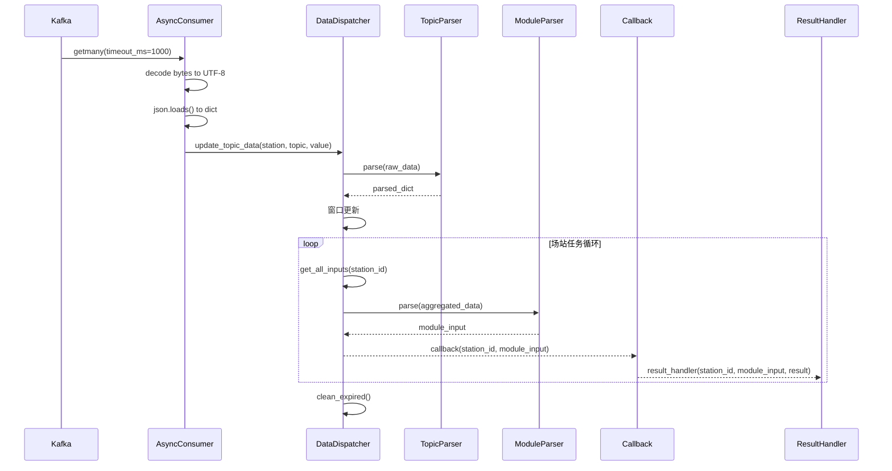

# 算法设计说明书（Data Analysis Module）

更新时间：2025-11-23  |  版本：v1.2

---

## 文档修订记录

| 版本 | 日期 | 修订内容 | 修订人 |
|------|------|----------|--------|
| v1.0 | 2025-10-23 | 初始版本 | - |
| v1.1 | 2025-11-07 | 根据实际代码全面修订，包括：<br/>1. 更新API方法名称（get_module_input → get_all_inputs）<br/>2. 补充result_handler参数说明<br/>3. 详细说明消息解码流程（bytes → UTF-8 → JSON）<br/>4. 更新Kafka客户端实现细节（getmany批量处理）<br/>5. 补充动态添加/移除场站功能<br/>6. 更新Topic配置字段名（匹配实际驼峰命名）<br/>7. 扩展错误处理和恢复策略说明<br/>8. 补充并发模型和线程安全详情<br/>9. 移除未实现的补全策略（当前版本不支持）<br/>10. 更新配置示例为实际生产配置 | -|
| v1.2 | 2025-11-23 | 融合批次结果聚合、数据质量元信息、全局数据缓存与多消费者/Offset修复方案：<br/>1. 描述`BatchResultAggregator`与`batch_upload_handler`契约<br/>2. 记录 `_data_quality` 元信息和使用示例<br/>3. 补充 `_global_data_cache` 工作流，避免全局topic丢失<br/>4. 文档化 `OffsetManager`、`OFFSET_COMMIT_CONFIG` 与提交策略<br/>5. 扩展 Kafka 多消费者模式、独立 `group_id` 与空拉取诊断指南 | - |

---

## 1. 概述

### 1.1 目标问题概述

本模块用于电力/能源场站多源数据的实时解析与分发，面向多业务模型（如负荷预测、价格评估、热管理、运营优化等）提供统一、稳健、可扩展的数据输入。系统从Kafka消费多Topic数据，进行窗口缓存、缺失补全与插值、跨模块依赖聚合，并以同步或异步方式将解析后的输入分发给业务模块或回调函数，可选将输出回传至Kafka供下游消费。

### 1.2 设计动因

- 多Topic异构数据：频率各异、字段不齐、存在缺失与乱序
- 多模块依赖：模块输入既依赖多Topic，也依赖其他模块的输出
- 高并发与多场站：需在资源可控下支持大量场站同时处理
- 可靠性与可观测性：稳定运行、可恢复、易监控与追踪
- 统一接口与低侵入：业务模块只关注“所需输入”，不关心数据清洗与治理细节

### 1.3 设计目标

- 可嵌入/可独立：既可作为库被模型集成，也可独立部署
- 同步/异步双栈：线程池同步处理与asyncio全链路异步处理
- 可插拔解析：Topic解析器和业务模块解析器均可扩展
- 完整的窗口管理与补全：支持 zero/linear/forward/missing 策略
- 高可用Kafka连接：重试、超时、生产者上传与消费者重连
- 健康监控与错误隔离：统一异常捕获与恢复，不拖垮主流程

## 2. 算法描述

### 2.1 运行流程

1. **Kafka消费**：按配置订阅多个Topic，结合 `multi_consumer_mode` 并发拉取，保证积压场景下的Topic公平性。
2. **消息反序列化**：将bytes解码为UTF-8字符串并 `json.loads` 为dict，失败时记录上下文并跳过。
3. **场站识别**：优先读取 `station_id`，否则回退 `host_id` / `meter_id`；未识别的消息仅记录日志。
4. **全局数据缓存/广播**：当解析到 `"__global__"` 场站（如 `SCHEDULE-ENVIRONMENT-CALENDAR`）时，将 payload 写入 `_global_data_cache`，即时广播给已存在的场站，并在后续新场站初始化时补发，防止冷启动期间丢失全局参数。
5. **Topic解析**：通过 `TopicParser` 输出结构化字段，并为设备聚合类Topic（DCDC/ACDC/Storage）维护嵌套字典。
6. **窗口更新**：按照 `TOPIC_DETAIL.window_size` 使用 `deque` 维护窗口；CAR-ORDER 等Topic包含秒级聚合与触发事件的特化逻辑。
7. **场站任务管理**：首次收到场站数据时动态创建 Task/Thread，并将 `_station_data_events`、`_station_batch_info` 等运行态与之绑定。
8. **模块输入组装与 `_data_quality`**：`DataDispatcher.get_module_input` 会聚合所有必需Topic窗口，对缺失Topic写入 `_data_quality.missing_topics`，对存在数据的Topic写入 `_data_quality.available_topics` 并计算 `availability_ratio`。
9. **业务回调**：将模块输入（或按模块过滤后的输入）传递给同步/异步 callback，业务可用 `_data_quality` 做降级或关键Topic校验。
10. **单场站结果处理**：若注册 `result_handler`，以 `(station_id, module_input, result)` 形式接收 callback 结果，常用于单站日志、监控或补偿上传。
11. **批次结果聚合**：若提供 `batch_upload_handler` 且批次包含多个场站，`BatchResultAggregator` 会跟踪批次进度，全部完成或超时后以 `(batch_id, results_list)` 调用 handler，实现一次性上传。
12. **Offset管理与清理**：`OffsetManager` 根据 `OFFSET_COMMIT_CONFIG` 追踪批次处理量与时间，满足条件即提交 offset；随后调度 `clean_expired()` 清理过期窗口数据，维持内存健康。

Mermaid时序图（异步主流程）：



### 2.2 核心数据结构与处理

- **多场站缓存**：`data_cache = {station_id: {topic: deque[(raw, ts)]}}`
  - 每个场站独立维护各Topic的数据窗口
  - 使用deque实现固定窗口大小（maxlen自动淘汰旧数据）
  - 每条数据附带时间戳用于过期检查

- **Topic→字段映射**：
  - TopicParser将原始消息解析为dict
  - ModuleParser从多个Topic的解析结果聚合字段
  - 字段按 `field_window`（列表）和 `field`（最新值）两种形式提供

- **依赖聚合机制**：
  - MODULE_DEPENDENCIES 定义模块间依赖关系
  - 依赖模块的输出通过专用Topic传递（如MODULE-OUTPUT-LOAD_PREDICTION）
  - get_all_inputs 方法自动聚合依赖模块的输出字段

- **场站任务管理**：
  - **异步服务**：每个场站一个asyncio Task，并发处理
  - **同步服务**：每个场站一个ThreadPoolExecutor提交的Future，线程池并发
  - 动态创建：首次收到场站消息时自动创建任务
  - 动态清理：数据过期或主动移除时停止任务

- **数据解码流程**：
  ```python
  # Kafka消息 → bytes
  msg.value  # bytes类型
  
  # 解码为字符串
  value_str = msg.value.decode("utf-8")
  
  # 解析为JSON字典
  value = json.loads(value_str)
  ```

### 2.3 主要模块/类

<a id="sec-2-3"></a>
#### 快速导航（2.3 主要模块/类）
- [2.3.1 DataDispatcher](#sec-2-3-1)
- [2.3.2 DataAnalysisService（同步）](#sec-2-3-2)
- [2.3.3 AsyncDataAnalysisService（异步）](#sec-2-3-3)
- [2.3.4 Kafka 客户端（同步/异步）](#sec-2-3-4)
- [2.3.5 异常类与回调契约](#sec-2-3-5)

本节合并了完整的接口与参数说明，涵盖构造参数、方法、返回与异常，来源于项目源代码解析与API文档校对。

<a id="sec-2-3-1"></a>
#### 2.3.1 DataDispatcher（数据分发与依赖处理核心）

**构造**：
```python
DataDispatcher(data_expire_seconds: int = 600)
```
- `data_expire_seconds`：窗口数据过期时间（秒），默认600

**关键属性**：
- `data_cache`：`{station_id: {topic: deque[(raw, ts)]}}`，多场站窗口缓存
- `parsers`：业务模块解析器映射字典
- `lock`：`threading.RLock`，确保线程安全的递归锁
- `padding_strategy`：窗口补全策略（已弃用，当前版本未实现补全功能）

**方法**：

1. **update_topic_data**(station_id: str, topic: str, raw_data: dict) -> None
   - 将原始数据追加到指定场站和topic的窗口队列
   - 自动创建窗口（deque，maxlen=window_size）
   - 附加时间戳：`(raw_data, time.time())`
   - 异常以DispatcherError记录并隔离
   - 线程安全：使用lock保护

2. **get_topic_window**(station_id: str, topic: str) -> list
   - 返回指定窗口的数据列表（仅data部分，不含时间戳）
   - 按时间升序排列
   - 场站或topic不存在时返回空列表

3. **get_module_input**(station_id: str, module: str) -> dict | None
   - 组装单个模块的输入数据
   - 流程：
     1. 遍历模块依赖的所有topic
     2. 获取每个topic的窗口数据
     3. 使用TopicParser解析最新数据
     4. 提取字段并创建`field_window`和`field`
     5. 处理模块依赖：从依赖模块的输出Topic获取数据
     6. 调用模块解析器（ModuleParser）生成最终输入
   - 异常处理：解析失败时记录日志并返回None
   - 线程安全

4. **get_all_inputs**(station_id: str) -> dict
   - 返回所有业务模块的输入结构：`{module: input_dict}`
   - 内部调用get_module_input遍历所有模块
   - 线程安全

5. **clean_expired**() -> None
   - 清理过期窗口数据
   - 检查每个窗口最新数据的时间戳
   - 超过data_expire_seconds则清空该窗口
   - 若场站所有窗口均为空，则移除整个场站缓存
   - 线程安全

6. **reload_config**(config_mod) -> None
   - 热更新Topic/窗口/依赖配置
   - 重新加载TOPIC_DETAIL、MODULE_DEPENDENCIES、MODULE_TO_TOPICS
   - 不影响现有窗口数据

7. **set_padding_strategy**(strategy: str) -> None
   - 设置窗口补全策略（当前版本未使用）
   - 支持策略：'zero'/'linear'/'forward'/'missing'
   - 断言验证策略有效性

**数据流示例**：
```python
# 更新数据
dispatcher.update_topic_data("station_001", "SCHEDULE-STATION-PARAM", {
    "station_id": "station_001",
    "lat": 30.5,
    "lng": 120.3
})

# 获取模块输入
input_data = dispatcher.get_module_input("station_001", "load_prediction")
# 返回: {
#   "lat": 30.5,
#   "lng": 120.3,
#   "lat_window": [30.5],
#   "lng_window": [120.3],
#   ...其他字段...
# }

# 获取所有模块输入
all_inputs = dispatcher.get_all_inputs("station_001")
# 返回: {
#   "load_prediction": {...},
#   "operation_optimization": {...},
#   ...
# }
```

<a id="sec-2-3-2"></a>
#### 2.3.2 DataAnalysisService（同步服务）

**构造**：
```python
DataAnalysisService(
    module_name: str | None = None,
    topics: list[str] | None = None,
    kafka_config: dict | None = None,
    data_expire_seconds: int = 600,
    result_handler: callable | None = None,
)
```

**参数说明**：
- `module_name`：指定业务模块名称，用于过滤topic和确定输出topic
- `topics`：要消费的topic列表
  - 若提供，直接使用该列表
  - 若未提供但指定module_name，使用MODULE_TO_TOPICS[module_name]
  - 否则使用所有已配置的topic
- `kafka_config`：Kafka连接配置，默认使用config.KAFKA_CONFIG
- `data_expire_seconds`：数据过期时间（秒），默认600
- `result_handler`：结果处理函数，签名为`(station_id, module_input, result) -> Any`

**关键属性**：
- `dispatcher`：DataDispatcher实例，负责数据分发
- `consumer`：KafkaConsumerClient实例，同步消费者
- `_executor`：ThreadPoolExecutor（max_workers=32），场站任务线程池
- `_station_threads`：`{station_id: Future}`，场站线程映射
- `_station_stop_events`：`{station_id: threading.Event}`，停止信号

**方法**：

1. **start**(callback: callable | None = None, result_handler: callable | None = None, background: bool = True) -> None
   - 启动服务，开始消费Kafka消息
   - `callback`：业务回调函数，签名`(station_id: str, module_input: dict) -> Any`
   - `result_handler`：结果处理函数，在callback之后调用
   - `background=True`：后台线程运行；False则前台阻塞运行
   - 回调异常被捕获并记录，不影响主流程
   - 回调返回值作为第三个参数传递给result_handler

2. **stop**() -> None
   - 停止主循环
   - 设置所有场站stop_event
   - 等待所有场站线程完成（最多5秒超时）
   - 关闭ThreadPoolExecutor
   - 关闭KafkaConsumer

3. **get_inputs**(station_id: str) -> dict
   - 返回指定场站的所有模块输入
   - 等价于`dispatcher.get_all_inputs(station_id)`

4. **get_outputs**(station_id: str) -> dict
   - 别名方法，等价于get_inputs
   - 向后兼容

5. **reload_config**() -> None
   - 重新加载config.py模块
   - 更新全局配置（KAFKA_CONFIG, TOPIC_TO_MODULES, MODULE_TO_TOPICS）
   - 调用dispatcher.reload_config()同步更新
   - 记录日志

6. **get_station_status**() -> dict
   - 返回所有场站线程的健康状态
   - 格式：`{station_id: {'running': bool, 'future': Future}}`
   - `running`：Future.running()，表示线程是否仍在运行

7. **get_service_status**() -> dict
   - 返回服务整体健康状态
   - 包含字段：
     - `main_thread_alive`：主线程是否存活
     - `consumer_alive`：consumer是否非None
     - `result_handler_registered`：是否注册了结果处理器
     - `station_count`：活跃场站数量

**异常**：
- 初始化时若Kafka连接失败，抛出KafkaConnectionError
- 运行时异常被handle_error统一处理和记录

**场站线程工作流程**：
```python
while not stop_event.is_set():
    outputs = dispatcher.get_all_inputs(station_id)
    module_input = outputs.get(module_name) if module_name else outputs
    
    # 调用业务回调
    result = callback(station_id, module_input) if callback else None
    
    # 调用结果处理器
    if result_handler:
        result_handler(station_id, module_input, result)
    
    time.sleep(2)  # 2秒间隔
```

<a id="sec-2-3-3"></a>
#### 2.3.3 AsyncDataAnalysisService（异步服务）

**构造**：
```python
AsyncDataAnalysisService(
    module_name: str | None = None,
    topics: list[str] | None = None,
    kafka_config: dict | None = None,
    data_expire_seconds: int = 600,
    result_handler: callable | None = None,
)
```

**参数说明**：与DataAnalysisService相同，但内部以asyncio实现

**关键属性**：
- `consumer`：AsyncKafkaConsumerClient实例，异步消费者
- `_station_tasks`：`{station_id: asyncio.Task}`，场站任务映射
- `_station_stop_flags`：`{station_id: asyncio.Event}`，停止信号
- `_main_task`：asyncio.Task，主循环任务
- `_stop_event`：asyncio.Event，服务级停止信号

**方法**：

1. **await start**(callback: callable | None = None, result_handler: callable | None = None) -> None
   - 启动异步服务
   - callback和result_handler支持同步或异步函数（自动检测）
   - 创建主循环Task，立即返回（非阻塞）

2. **await stop**() -> None
   - 设置停止事件
   - 等待主循环Task完成
   - 自动停止所有场站Task
   - 关闭AsyncKafkaConsumer

3. **get_inputs**(station_id: str) -> dict
   - 同步方法，返回指定场站的所有模块输入
   - 等价于`dispatcher.get_all_inputs(station_id)`

4. **await add_station**(station_id: str, callback: callable | None = None, result_handler: callable | None = None) -> None
   - 动态添加场站任务
   - 为新场站创建独立的asyncio.Task
   - 可指定专属的回调函数和结果处理器
   - 若场站已存在则不重复创建

5. **await remove_station**(station_id: str) -> None
   - 动态移除场站任务
   - 设置场站stop_flag
   - 等待Task完成
   - 清理任务映射

6. **get_station_status**() -> dict
   - 返回所有场站Task的健康状态
   - 格式：`{station_id: {'running': bool, 'task': asyncio.Task}}`
   - `running`：`not task.done()`

**主循环工作流程**：
```python
async def _main_loop():
    await consumer.start()
    
    while not stop_event.is_set():
        # 批量获取消息
        batch = await consumer.getmany(timeout_ms=1000)
        
        for msg in batch:
            # 解码消息
            value_str = msg.value.decode("utf-8")
            value = json.loads(value_str)
            
            # 提取场站ID
            station_id = value.get("station_id") or value.get("host_id") or value.get("meter_id")
            
            # 更新数据窗口
            dispatcher.update_topic_data(station_id, msg.topic, value)
            
            # 为新场站创建Task
            if station_id not in _station_tasks:
                task = asyncio.create_task(_station_worker(station_id, ...))
                _station_tasks[station_id] = task
        
        # 清理过期数据
        dispatcher.clean_expired()
    
    await consumer.stop()
```

**场站任务工作流程**：
```python
async def _station_worker(station_id, callback, result_handler, stop_flag):
    while not stop_flag.is_set():
        # 获取模块输入
        inputs = dispatcher.get_all_inputs(station_id)
        module_input = inputs.get(module_name) if module_name else inputs
        
        # 调用业务回调（支持同步/异步）
        result = await _maybe_await(callback, station_id, module_input)
        
        # 调用结果处理器（支持同步/异步）
        await _maybe_await(result_handler, station_id, module_input, result)
        
        await asyncio.sleep(2)
```

**_maybe_await辅助方法**：
- 自动检测函数返回值是否为协程
- 若是协程，使用await等待
- 若是普通值，直接返回
- 支持同步和异步回调的统一处理

<a id="sec-2-3-4"></a>
#### 2.3.4 Kafka 客户端（同步/异步）

**配置兼容性**：
- 支持嵌套配置（推荐）：`{'consumer': {...}, 'producer': {...}}`
- 支持扁平配置（向后兼容）：`{'bootstrap_servers': ..., 'group_id': ...}`
- bootstrap_servers读取优先级：
  1. 子配置中的bootstrap_servers（如consumer.bootstrap_servers）
  2. 顶层的bootstrap_servers
- 其他参数优先从子配置读取，子配置中不存在时回退到顶层

##### KafkaConsumerClient（同步消费者）

**构造**：
```python
KafkaConsumerClient(
    topics: list[str],
    config: dict,
    max_retries: int = 5,
    retry_interval: int = 5
)
```

**参数说明**：
- `topics`：订阅的topic列表
- `config`：Kafka配置字典
- `max_retries`：连接重试次数，默认5
- `retry_interval`：重试间隔（秒），默认5

**方法**：
- **poll**(timeout_ms: int = 1000) -> dict[TopicPartition, list[Message]]
  - 轮询消息，返回`{TopicPartition: [Message]}`
  - 连接失败时自动重试
  - 异常被捕获并记录，返回空dict继续运行
  
- **close**() -> None
  - 关闭消费者连接
  - 异常被捕获并记录

**支持的配置参数**（kafka-python白名单）：
```python
group_id, auto_offset_reset, enable_auto_commit, max_poll_records,
session_timeout_ms, request_timeout_ms, heartbeat_interval_ms,
max_poll_interval_ms, security_protocol, sasl_mechanism,
sasl_plain_username, sasl_plain_password, ssl_cafile, ssl_certfile, ssl_keyfile
```

**value反序列化**：自动使用`json.loads`将JSON字符串解析为dict

##### KafkaProducerClient（同步生产者）

**构造**：
```python
KafkaProducerClient(
    config: dict,
    max_retries: int = 5,
    retry_interval: int = 5
)
```

**方法**：
- **send**(topic: str, value: dict) -> None
  - 发送消息并立即flush
  - 失败时重试max_retries次
  - 最终失败抛出异常
  
- **close**() -> None
  - 关闭生产者连接

**支持的配置参数**（kafka-python白名单）：
```python
acks, retries, compression_type, linger_ms, batch_size,
max_in_flight_requests_per_connection, buffer_memory,
security_protocol, sasl_mechanism, sasl_plain_username, sasl_plain_password,
ssl_cafile, ssl_certfile, ssl_keyfile
```

**value序列化**：
```python
value_serializer=lambda m: json.dumps(m, ensure_ascii=False).encode('utf-8')
```

##### AsyncKafkaConsumerClient（异步消费者）

**构造**：
```python
AsyncKafkaConsumerClient(
    topics: list[str],
    config: dict,
    loop=None
)
```

**方法**：
- **await start**() -> None
  - 启动异步消费者
  - 必须先调用start才能使用getmany/getone
  
- **await getmany**(timeout_ms: int = 1000, max_records: int = 1) -> list[Message]
  - 批量获取消息
  - 返回消息列表（扁平化所有分区的消息）
  - 未启动时抛出RuntimeError
  
- **await getone**(timeout_ms: int = 1000) -> Message | None
  - 获取单条消息
  - 内部使用_pending_messages缓存批量获取的消息
  - 返回None表示超时无消息
  
- **await stop**() -> None
  - 停止异步消费者

**支持的配置参数**（aiokafka白名单）：
```python
group_id, auto_offset_reset, enable_auto_commit, session_timeout_ms,
request_timeout_ms, heartbeat_interval_ms, max_poll_records,
max_poll_interval_ms, security_protocol, sasl_mechanism,
sasl_plain_username, sasl_plain_password
```

##### AsyncKafkaProducerClient（异步生产者）

**构造**：
```python
AsyncKafkaProducerClient(
    config: dict,
    loop=None
)
```

**方法**：
- **await start**() -> None
  - 启动异步生产者
  - 必须先调用start才能发送消息
  
- **await send**(topic: str, value: dict) -> None
  - 异步发送消息并等待确认（send_and_wait）
  - 未启动时抛出RuntimeError
  - 异常被记录并抛出
  
- **await stop**() -> None
  - 停止异步生产者

**支持的配置参数**（aiokafka白名单）：
```python
acks, compression_type, linger_ms, security_protocol, sasl_mechanism,
sasl_plain_username, sasl_plain_password
```

**配置示例**：
```python
# 嵌套配置（推荐）
KAFKA_CONFIG = {
    'bootstrap_servers': ['10.8.4.40:35888'],
    'consumer': {
        'group_id': 'data_analysis',
        'auto_offset_reset': 'latest',
        'enable_auto_commit': False,
        'max_poll_records': 3000,
    },
    'producer': {
        'acks': 'all',
        'compression_type': 'gzip',
    }
}

# 扁平配置（向后兼容）
KAFKA_CONFIG = {
    'bootstrap_servers': ['10.8.4.40:35888'],
    'group_id': 'data_analysis',
    'auto_offset_reset': 'latest',
}
```

###### 多消费者模式（multi_consumer_mode）

- **启用方式**：在 `KAFKA_CONFIG['consumer']` 中设置 `multi_consumer_mode=True`（默认开启）。当订阅Topic数量>1时，`AsyncKafkaConsumerClient` 会为每个Topic创建独立的 `AIOKafkaConsumer`，并使用 `asyncio.gather` 并发 `getmany`，彻底缓解“Topic饥饿”。
- **group_id 策略**：推荐为每个Topic派生独立的 `group_id`（如 `f"{base_group}-{topic}"`），以避免多消费者共享同一组导致的 `Fetch offset is out of range`。仓库提供 `tests/verify_group_id_fix.py` 用于CI/本地校验，保证不会回退到旧行为。
- **空拉取/积压诊断**：`multi_consumer_mode` 会分别记录每个Topic拉取数量并打印日志。出现空拉取时，可结合 `OffsetOutOfRangeError` 日志、Kafka消费者组Lag以及 `getmany(timeout)` 的返回长度判断是否需要调整 `max_poll_records` 或 `auto_offset_reset`。
- **回退**：当仅订阅单一Topic或受资源限制时，可将 `multi_consumer_mode=False` 回退至单消费者模式；此时 `max_records` 限制应用于所有Topic的总量。

<a id="sec-2-3-5"></a>
#### 2.3.5 异常类与回调契约

**异常类**（定义在errors.py）：

1. **DataAnalysisError**
   - 基础异常类，所有业务异常的父类
   - 用于数据契约不满足的情况（如非dict、缺少ID字段）

2. **KafkaConnectionError**
   - 继承自DataAnalysisError
   - Kafka连接、消费、发送失败时抛出
   - 触发场景：
     - 初始化Consumer/Producer失败
     - 网络断开
     - 认证失败
     - 超时

3. **DispatcherError**
   - 继承自DataAnalysisError
   - 数据分发、解析、依赖处理异常
   - 触发场景：
     - Topic解析失败
     - 模块解析失败
     - 依赖模块缺失
     - 窗口数据异常

**错误处理函数**：
```python
def handle_error(
    exc: BaseException,
    *,
    context: Optional[str] = None,
    recover: Optional[Callable[[], Any]] = None,
) -> None
```
- 统一的错误处理和日志记录
- 记录完整的堆栈跟踪
- 支持可选的恢复回调
- 错误日志同时输出到控制台和文件（data_analysis.log）

**日志配置**：
- 格式：`[%(asctime)s] %(levelname)s %(name)s %(message)s`
- 级别：INFO
- 输出：StreamHandler（控制台）+ FileHandler（data_analysis.log）
- 编码：UTF-8

**回调函数契约**：

1. **业务回调（callback）**：
```python
# 同步回调
def callback(station_id: str, module_input: dict) -> Any:
    """
    Args:
        station_id: 场站ID
        module_input: 模块输入数据（dict格式）
            - 若指定module_name，则为该模块的输入
            - 否则为所有模块的输入字典 {module: input}
    
    Returns:
        Any: 处理结果，将传递给result_handler
        - 返回None时，result_handler接收module_input
        - 返回其他值时，result_handler接收该值
    """
    pass

# 异步回调（AsyncDataAnalysisService支持）
async def callback(station_id: str, module_input: dict) -> Any:
    await some_async_operation()
    return result
```

2. **结果处理器（result_handler）**：
```python
# 同步结果处理器
def result_handler(station_id: str, module_input: dict, result: Any) -> None:
    """
    Args:
        station_id: 场站ID
        module_input: 模块输入数据
        result: callback的返回值（可能为None）
    
    典型用途：
        - 上传结果到Kafka
        - 保存到数据库
        - 发送到下游系统
        - 日志记录和监控
    """
    pass

# 异步结果处理器（AsyncDataAnalysisService支持）
async def result_handler(station_id: str, module_input: dict, result: Any) -> None:
    await upload_to_kafka(result)
```

**异常处理策略**：
- callback和result_handler中的异常被自动捕获
- 使用handle_error记录详细信息
- 不会中断主循环或其他场站的处理
- 场站任务会继续运行（2秒间隔重试）

**回调执行顺序**：
```python
# 1. 获取模块输入
module_input = dispatcher.get_all_inputs(station_id)

# 2. 执行业务回调
result = callback(station_id, module_input)  # 可能为None

# 3. 执行结果处理器
result_handler(station_id, module_input, result)
```

**线程安全说明**：
- DataAnalysisService：不同场站的回调在不同线程中执行
- AsyncDataAnalysisService：不同场站的回调在不同Task中并发执行
- 回调函数应避免共享可变状态，或使用适当的同步机制

<a id="sec-2-3-6"></a>
#### 2.3.6 BatchResultAggregator（批次结果聚合器）

**位置**：`d_a/batch_result_aggregator.py`

**用途**：当单条Kafka消息携带多个场站（尤其是 `SCHEDULE-STATION-REALTIME-DATA`）的数据时，逐场站上传会导致同一批数据的结果分散。`BatchResultAggregator` 将同一批内的所有场站结果在内存中聚合，全部到齐或超时后由 `batch_upload_handler(batch_id, results_list)` 一次性上传。

**核心结构**：
- `BatchResultAggregator`：维护 `{batch_id: BatchCollector}`、批次超时（默认5秒）以及清理逻辑。
- `BatchCollector`：持有 `expected_stations` 集合、`_results` 字典和 `asyncio.Event`；在 `add_result(station_id, result)` 时跟踪进度。

**典型流程**：
```python
# _main_loop 中解析完一批消息后：
if batch_ids and batch_upload_handler:
    collector = await batch_aggregator.get_or_create_batch(batch_id, stations, batch_upload_handler)

# 每个场站worker完成时：
await collector.add_result(station_id, result)

# BatchCollector 内部：
if len(_results) == expected_count:
    await _do_upload()  # or timeout触发 force_complete()

async def _do_upload():
    payload = [result for result in _results.values() if result is not None]
    await batch_upload_handler(batch_id, payload)
```

**回调契约**：
- `AsyncDataAnalysisService.start(..., batch_upload_handler=my_handler)` 启用批次聚合；若未提供 handler，系统保持旧的逐场站 `result_handler` 行为。
- `batch_upload_handler` 接收 `(batch_id, results_list)`，其中 `results_list` 仅包含非 `None` 的场站结果；建议业务在 callback 返回值中显式注入 `station_id` 以便组装上传载荷。
- 批次 ID 由服务根据当前批内消息的时间戳或 `sendTime` 构造（形如 `SCHEDULE-STATION-REALTIME-DATA_1699999200`），超时会写出缺失场站数量的警告日志。

**容错**：
- 某场站 callback 抛错或返回 `None` 只会影响其自身，不会阻止批次上传。
- `_monitor_batch` 使用 `asyncio.wait_for` + `batch_timeout` 控制最长等待，并在 `BatchCollector.force_complete()` 中打印成功/失败/无输出计数，便于排查。

<a id="sec-2-3-7"></a>
#### 2.3.7 OffsetManager（异步offset调度）

**位置**：`d_a/offset_manager.py`

**目的**：统一跟踪 `AsyncKafkaConsumerClient` 的消费进度并批量提交 offset，避免 `enable_auto_commit=True` 带来的不可控延迟，同时减少对Kafka的提交压力。

**主要方法**：

| 方法 | 说明 |
|------|------|
| `track_message(msg)` | 消费到消息后立即记录 `(topic, partition) -> msg.offset+1)`，并增加 `_processed_count` |
| `should_commit()` | 依据 `commit_batch_size`（默认100）和 `commit_interval_seconds`（默认5秒）判断是否触发提交 |
| `await commit()` | 将 `_pending_offsets` 转换为 `TopicPartition → OffsetAndMetadata`，按 `max_commit_retries` 与 `commit_retry_delay` 进行重试提交，成功后清空状态 |

**配置**：`OFFSET_COMMIT_CONFIG` 默认值：

| 字段 | 默认值 | 含义 |
|------|--------|------|
| `commit_interval_seconds` | 5.0 | 即使未到批次大小，也会在该时间后提交 |
| `commit_batch_size` | 100 | 处理满100条消息立即提交 |
| `max_commit_retries` | 3 | 单次提交的最大重试次数 |
| `commit_retry_delay` | 1.0 | 重试之间的延迟（秒） |

**运行时集成**：
- `_main_loop` 每次 `getmany` 之后都会调用 `offset_manager.track_message(msg)`（在解析流程中完成），并在批次结束或空拉取时检查 `should_commit()`；Service 停止前会强制 `commit()` 确保不丢offset。
- 若提交失败会保留 `_pending_offsets`，下个周期重试，不会出现 offset 回退。

<a id="sec-2-3-8"></a>
#### 2.3.8 全局数据缓存与场站自举

**场景**：`SCHEDULE-ENVIRONMENT-CALENDAR` 等全局Topic可能在任何场站出现之前就到达，旧逻辑会因“尚无场站”而丢弃消息。

**机制**：
- `_global_data_cache: {topic: latest_payload}`：记录最近一次全局topic的值。
- 当 `station_id == "__global__"` 时：
  1. 将 payload 写入缓存。
  2. 若已有场站任务，实时广播到所有场站（并触发 `_station_data_events`）。
  3. 若暂无场站，仅记录日志“等待场站注册”。
- 新场站通过 `add_station()` 创建任务时，会遍历 `_global_data_cache`，把所有全局Topic的最新值回放给该场站，确保冷启动即可拿到日历/配置数据。

**优点**：解决先有全局数据、后有场站的竞态；缓存体积极小（Topic级别的最新一条记录），无需额外清理。

<a id="sec-2-3-9"></a>
#### 2.3.9 数据可用性元信息 `_data_quality`

**来源**：`DataDispatcher.get_module_input()` 会在返回的字典中附加 `_data_quality` 字段，用于业务方评估各Topic数据是否可用。

**字段含义**：

| 字段 | 类型 | 描述 |
|------|------|------|
| `available_topics` | list[str] | 当前窗口中至少有一条数据的Topic列表（不区分新旧，慢速Topic使用缓存属正常） |
| `missing_topics` | list[str] | 完全没有数据的Topic，用于快速定位缺口 |
| `total_topics` | int | 模块所需Topic总数 |
| `availability_ratio` | float | 可用比率 = `available_topics / total_topics` |

**使用示例**：
```python
def callback(station_id, module_input):
    quality = module_input.get('_data_quality', {})
    if quality.get('availability_ratio', 0) < 0.8:
        return None  # 数据不足，等待下一次
    if 'SCHEDULE-CAR-ORDER' not in quality.get('available_topics', []):
        return None  # 关键Topic缺失
    return run_model(module_input)
```

**最佳实践**：
- 对关键Topic建立白名单检查，缺失即降级或报警。
- 在 `result_handler` / 监控模块中记录 `availability_ratio`，作为数据质量指标。
- 若慢速Topic经常被标记为缺失，检查 `data_expire_seconds` 是否过短或Producer是否异常。

### 2.4 输入与输出

**输入**：
1. **Kafka消息**（多Topic）：
   - 消息格式：bytes编码的JSON字符串
   - 消息解码流程：
     ```python
     value_str = msg.value.decode("utf-8")
     value = json.loads(value_str)
     ```
   - 每条消息必须包含以下字段之一用于场站路由：
     - `station_id`：场站ID（优先）
     - `host_id`：主机ID
     - `meter_id`：电表ID

2. **配置文件**（config.py）：
   - **KAFKA_CONFIG**：Kafka连接配置
     - 支持嵌套结构（推荐）：`{'consumer': {...}, 'producer': {...}}`
     - 支持扁平结构（向后兼容）：`{'bootstrap_servers': ..., 'group_id': ...}`
     - 必需字段：`bootstrap_servers`（字符串列表）
   
   - **TOPIC_DETAIL**：Topic详细配置
     ```python
     {
         'TOPIC-NAME': {
             'fields': ['field1', 'field2', ...],  # 字段列表
             'frequency': '更新频率描述',
             'modules': ['module1', 'module2'],    # 依赖此topic的模块
             'window_size': int                    # 窗口大小
         }
     }
     ```
   
   - **MODULE_DEPENDENCIES**：模块间依赖关系
     ```python
     {
         'module_a': ['module_b', 'module_c'],  # module_a依赖module_b和module_c的输出
     }
     ```
   
   - **MODULE_OUTPUT_TOPICS**：模块输出Topic映射
     ```python
     {
         'module_name': 'MODULE-OUTPUT-MODULE_NAME'
     }
     ```

**输出**：
1. **get_all_inputs(station_id) → dict**：
   - 返回格式：`{module_name: module_input_dict}`
   - 每个module_input_dict包含：
     - 字段窗口：`field_window`（列表）
     - 最新值：`field`（标量）
     - 依赖模块输出：`dep_module_field`

2. **get_module_input(station_id, module) → dict | None**：
   - 返回单个模块的输入数据
   - 解析失败返回None

3. **回调函数输出**（可选）：
   - callback返回值作为result参数传递给result_handler
   - result_handler可实现：
     - Kafka上传：将结果发送到输出Topic
     - 数据库存储
     - 下游系统调用
     - 监控指标上报
    - 若启用了 `BatchResultAggregator`，请确保callback返回的dict包含 `station_id`（或可在batch handler中自行注入），以便批次上传时关联场站。

4. **批次上传回调**（可选）：
    - 通过 `AsyncDataAnalysisService.start(..., batch_upload_handler=handler)` 注册
    - 签名：`handler(batch_id: str, results_list: list[dict])`
    - `results_list` 仅包含返回非 `None` 的场站结果；batch超时也会调用handler，方便补数/报警。

5. **标准输出格式**（用于Kafka上传）：
   ```python
   {
       'station_id': str,        # 场站ID
       'module': str,            # 模块名称
       'output': Any,            # 模块输出结果
       'timestamp': float,       # 时间戳
       'input': dict             # 可选：模块输入数据
   }
   ```

**数据流示例**：
```python
# 输入消息
kafka_message = {
    "station_id": "station_001",
    "lat": 30.5,
    "lng": 120.3,
    "gun_count": 12
}

# 处理后的模块输入
module_input = {
    "lat": 30.5,
    "lng": 120.3,
    "gun_count": 12,
    "lat_window": [30.5],
    "lng_window": [120.3],
    "gun_count_window": [12],
    # 依赖模块输出
    "load_prediction_forecast": [100, 120, 150],
    "load_prediction_timestamp": 1699000000
}

# 回调处理
result = callback("station_001", module_input)

# 结果处理（上传到Kafka）
output = {
    "station_id": "station_001",
    "module": "operation_optimization",
    "output": result,
    "timestamp": time.time()
}
```

### 2.5 开发与运行环境

- 语言：Python 3.9+
- 依赖：kafka-python、aiokafka、numpy、pytest、python-docx（仅用于文档导出脚本）
- 运行：Linux/Windows；Kafka 2.2+

## 3. 算法契约（Inputs/Outputs/Errors）

**输入契约**：
1. **Kafka消息格式**：
   - 必须为bytes类型的UTF-8编码JSON字符串
   - 解析为dict后必须包含以下字段之一：
     - `station_id`（优先）
     - `host_id`
     - `meter_id`
   - 字段值不为None和空字符串

2. **Topic配置**：
   - 每个消费的Topic必须在TOPIC_DETAIL中配置
   - `window_size` ≥ 1
   - `fields`列表可为空（解析器自行处理）

3. **模块配置**：
   - MODULE_TO_TOPICS中的topic必须在TOPIC_DETAIL中存在
   - MODULE_DEPENDENCIES中引用的模块必须有对应的输出Topic配置

**输出契约**：
1. **模块输入结构**：
   - get_all_inputs返回：`{module: input_dict}`
   - get_module_input返回：`dict | None`
   - input_dict包含：
     - 原始字段：`field`（最新值）
     - 窗口字段：`field_window`（列表）
     - 依赖字段：`dep_module_output`或`dep_module_field`

2. **字段命名规范**：
   - 窗口字段：原字段名 + `_window`后缀
   - 依赖输出：依赖模块名 + `_output`或具体字段名
   - 示例：
     ```python
     {
         "lat": 30.5,                    # 最新值
         "lat_window": [30.4, 30.5],     # 窗口
         "load_prediction_forecast": [100, 120, 150],  # 依赖字段
     }
     ```

3. **空数据处理**：
   - Topic无数据时，对应字段为None，窗口为空列表`[]`
   - 解析失败时，get_module_input返回None
   - 不影响其他模块的正常处理

**错误模式与处理**：

1. **Kafka连接失败**：
   - 触发：网络断开、认证失败、Broker不可用
   - 处理：
     - 初始化阶段：重试max_retries次后抛出KafkaConnectionError
     - 运行时阶段：记录日志，等待retry_interval后自动重连
   - 影响：阻塞当前操作，不影响已建立的场站任务

2. **消息解析失败**：
   - 触发：非JSON格式、缺少ID字段、非dict类型
   - 处理：
     - 使用handle_error记录详细日志（包括堆栈跟踪）
     - 跳过该消息，继续处理下一条
   - 影响：仅影响当前消息，不影响主流程

3. **Topic解析异常**：
   - 触发：TopicParser.parse()抛出异常
   - 处理：
     - 捕获并记录为DispatcherError
     - 该Topic的解析结果置为None
     - 继续组装其他Topic的数据
   - 影响：该Topic相关字段缺失，其他字段正常

4. **模块解析异常**：
   - 触发：ModuleParser.parse()抛出异常
   - 处理：
     - 捕获并记录为DispatcherError
     - get_module_input返回None
   - 影响：该模块的输入为None，其他模块正常

5. **依赖模块缺失**：
   - 触发：依赖模块尚未产生输出数据
   - 处理：
     - 依赖字段设为None或空
     - 继续组装其他可用数据
   - 影响：模块输入结构不完整，但不阻塞处理

6. **回调函数异常**：
   - 触发：callback或result_handler内部抛出异常
   - 处理：
     - 捕获并记录详细日志
     - 不传播异常，避免影响其他场站
     - 2秒后重试（场站任务持续运行）
   - 影响：仅影响当前场站的当次处理

7. **数据过期**：
   - 触发：场站长时间无新数据（超过data_expire_seconds）
   - 处理：
     - clean_expired()清空该场站的所有窗口
     - 若所有Topic窗口为空，移除整个场站缓存
     - 场站任务继续运行，等待新数据
   - 影响：get_all_inputs返回空字典

**错误恢复策略**：
- Kafka连接失败：指数退避重试（最多max_retries次）
- 瞬态异常：记录日志并继续（如解析失败）
- 持久性异常：停止服务并抛出异常（如配置错误）
- 隔离原则：单个场站或模块的异常不影响其他场站/模块

## 4. 性能标准与验收标准

### 4.1 性能标准（建议值，可按规模调优）

- 吞吐量：单实例每秒处理消息数≥N（与分区数与CPU相关，按部署SLA设定）
- 端到端延迟：95分位 ≤ 1s（异步链路，消息到模块输入）
- 内存占用：受 window_size 与场站数线性增长，常态<1GB（按配置评估）
- 重连恢复：Kafka短暂故障恢复≤30s，无数据丢失（acks=all 前提）

### 4.2 验收标准（必达项）

- 功能验收：
  - 多Topic消息正确聚合为模块输入
  - 四种补全策略符合定义与示例
  - 依赖模块聚合字段正确、无循环死锁
  - 同步与异步服务均可运行，支持回调与Kafka上传
- 稳定性验收：
  - Kafka断连/异常自动恢复，主循环不中断
  - 过期清理正确回收窗口数据，无内存泄露
- 兼容性验收：
  - KAFKA_CONFIG 支持嵌套与扁平两种格式
  - Windows/Linux 环境可运行（tests 全通过）

## 5. 关键算法细节与边界场景

### 5.1 数据窗口管理

**窗口实现**：
- 使用`collections.deque(maxlen=window_size)`
- 自动淘汰最旧数据（FIFO队列）
- 每条数据附加时间戳：`(raw_data, time.time())`

**边界情况**：
1. **空窗口**：
   - 场站首次出现或数据已过期
   - get_topic_window返回空列表`[]`
   - 字段窗口为空列表，最新值为None

2. **窗口未满**：
   - 新场站数据积累阶段
   - 直接返回现有数据，不进行填充或插值
   - 示例：window_size=100，仅收到10条数据时返回10条

3. **窗口已满**：
   - 达到maxlen限制
   - 新数据追加时自动移除最旧数据
   - 保持窗口大小恒定

### 5.2 消息处理流程

**消息解码**：
```python
# 步骤1: 获取bytes消息
msg = await consumer.getone()

# 步骤2: 解码为UTF-8字符串
value_str = msg.value.decode("utf-8")

# 步骤3: JSON解析为dict
value = json.loads(value_str)
```

**场站路由优先级**：
```python
station_id = (
    value.get("station_id")     # 优先级1
    or value.get("host_id")     # 优先级2
    or value.get("meter_id")    # 优先级3
)
```

**批量处理**（异步服务）：
- 使用`getmany(timeout_ms=1000)`批量获取消息
- 一次处理一批消息，减少网络往返
- 示例：
  ```python
  batch = await consumer.getmany(timeout_ms=1000)
  for msg in batch:
      process_message(msg)
  ```

### 5.3 模块依赖处理

**依赖解析顺序**：
1. 解析当前模块直接依赖的Topic数据
2. 查找MODULE_DEPENDENCIES中的依赖模块列表
3. 对每个依赖模块：
   - 获取其输出Topic的窗口数据
   - 使用对应的解析器解析
   - 提取最新值或全部窗口
4. 将依赖字段合并到模块输入中

**依赖数据格式**：
```python
# 依赖模块输出（dict）
{
    "forecast": [100, 120, 150],
    "confidence": 0.95,
    "timestamp": 1699000000
}

# 合并到输入后
{
    "load_prediction_output_window": {...},  # 完整输出对象
    "load_prediction_forecast": [100, 120, 150],  # 具体字段
    "load_prediction_confidence": 0.95,
    "load_prediction_timestamp": 1699000000
}
```

**循环依赖检测**：
- 当前版本未实现自动检测
- 配置错误（如A依赖B，B依赖A）会导致数据缺失
- 建议：人工审查MODULE_DEPENDENCIES确保无循环

### 5.4 数据清理机制

**过期检查**：
```python
now = time.time()
for station_id, topic_map in data_cache.items():
    for topic, window in topic_map.items():
        if window and (now - window[-1][1] > data_expire_seconds):
            window.clear()  # 清空窗口
```

**场站清理**：
- 所有Topic窗口为空时，移除整个场站
- 避免内存泄漏
- 场站任务继续运行，等待新数据

**清理频率**：
- 同步服务：每次主循环迭代（约1秒间隔）
- 异步服务：每次消息批处理后

### 5.5 并发与线程安全

**同步服务**：
- 主线程：Kafka消费循环
- 场站线程池：ThreadPoolExecutor（max_workers=32）
- 每个场站一个独立线程
- DataDispatcher使用RLock保护data_cache

**异步服务**：
- 主Task：Kafka消费循环
- 场站Task：每个场站一个独立Task
- 使用asyncio并发模型（单线程事件循环）
- DataDispatcher的锁机制仍有效（防止线程竞争）

**锁策略**：
```python
with self.lock:  # RLock，支持递归加锁
    # update_topic_data
    # get_module_input
    # get_all_inputs
    # clean_expired
```

### 5.6 边界场景处理

**大窗口/高频场景**：
- 示例：7天历史数据，1秒频率 = 604800条数据
- 内存占用：取决于消息大小和场站数量
- 建议：
  - 合理设置window_size
  - 使用数据压缩（如gzip）
  - 监控内存使用

**消息乱序**：
- 当前实现：按到达顺序入队，不排序
- 时间戳仅用于过期检查
- 业务层可结合timestamp字段自行排序

**消息重复**：
- Kafka at-least-once语义可能导致重复
- 当前实现：不去重，直接入队
- 业务层需自行处理幂等性

**网络分区**：
- Consumer暂时无法连接Kafka
- 自动重试机制（max_retries=5）
- 重连后从上次offset继续消费（取决于enable_auto_commit配置）

**热更新场景**：
```python
# 运行时更新配置
service.reload_config()

# 效果:
# - TOPIC_DETAIL更新 -> 新Topic生效
# - MODULE_DEPENDENCIES更新 -> 依赖关系变化
# - 现有窗口数据保留
# - 不需要重启服务
```

## 6. 监控与可观测性

- 日志：模块化日志，错误统一 handle_error(context)
- 指标（可选）：处理总量、错误计数、内存使用、处理耗时直方图
- 健康检查：/health 提供基本存活信息

## 7. 安全与可用性

### 7.1 Kafka可靠性保障

**生产者配置**：
```python
'producer': {
    'acks': 'all',           # 所有副本确认
    'retries': 3,            # 发送失败重试3次
    'compression_type': 'gzip',  # 数据压缩
}
```
- `acks='all'`：等待所有ISR副本确认，降低丢失风险
- `retries≥3`：网络抖动时自动重试
- compression：减少网络传输量

**消费者配置**：
```python
'consumer': {
    'group_id': 'data_analysis',
    'auto_offset_reset': 'latest',      # 新消费组从最新位置开始
    'enable_auto_commit': False,        # 手动提交offset（可选）
    'max_poll_records': 3000,           # 批量拉取
}
```
- `group_id`：消费者组隔离
- `enable_auto_commit=False`：精确控制offset提交时机
- `max_poll_records`：批量处理提升吞吐量

**连接重试机制**：
- 初始化阶段：最多重试max_retries=5次，间隔retry_interval=5秒
- 运行时阶段：poll/send失败自动重连，不中断主循环
- 指数退避（可选）：避免频繁重连导致雪崩

### 7.2 配置热更新

**支持的更新**：
```python
service.reload_config()
```
- TOPIC_DETAIL：添加/修改Topic配置
- MODULE_DEPENDENCIES：调整模块依赖关系
- MODULE_TO_TOPICS：变更模块订阅的Topic

**不支持的更新**：
- KAFKA_CONFIG：需要重启服务（影响连接）
- 窗口大小变更：现有窗口保持原大小，新数据按新配置

**更新流程**：
1. importlib.reload(config_mod)
2. 更新全局配置变量
3. 调用dispatcher.reload_config(config_mod)
4. 记录更新日志

**注意事项**：
- 配置文件语法错误会导致reload失败
- 建议在低峰期执行热更新
- 更新前备份原配置文件

### 7.3 异常隔离与容错

**多级隔离**：
1. **消息级**：单条消息解析失败，跳过并继续
2. **Topic级**：单个Topic解析失败，不影响其他Topic
3. **模块级**：单个模块解析失败，返回None，其他模块正常
4. **场站级**：单个场站异常，不影响其他场站
5. **服务级**：回调异常不传播到主循环

**异常捕获范围**：
```python
try:
    # 核心业务逻辑
except SpecificError as e:
    handle_error(e, context="详细上下文")
    # 降级处理或跳过
except Exception as e:  # noqa: BLE001
    handle_error(e, context="兜底捕获")
    # 确保主流程继续运行
```

**容错策略**：
- 解析失败：返回None或空列表，不抛出异常
- 依赖缺失：字段置None，继续组装其他数据
- 回调异常：记录日志，2秒后重试
- 连接失败：自动重连，最多重试max_retries次

### 7.4 线程与协程安全

**同步服务线程模型**：
```
主线程（Kafka消费）
  └─ ThreadPoolExecutor (32 workers)
       ├─ 场站线程1
       ├─ 场站线程2
       └─ 场站线程N
```

**异步服务协程模型**：
```
主Task（Kafka消费）
  ├─ 场站Task1
  ├─ 场站Task2
  └─ 场站TaskN
```

**数据保护**：
- DataDispatcher.data_cache：使用threading.RLock保护
- 递归锁：同一线程可多次获取（如get_all_inputs调用get_module_input）
- 异步服务：虽然单线程，但锁机制仍有效（防止未来多线程扩展）

**无锁设计**（优化方向）：
- 每个场站独立缓存：避免跨场站竞争
- 写时复制（COW）：读操作无需加锁
- 不可变数据结构：避免并发修改问题

### 7.5 资源管理

**连接资源**：
```python
try:
    service = DataAnalysisService(...)
    service.start(...)
finally:
    service.stop()  # 确保资源释放
```

**线程池管理**：
```python
# 自动管理
_executor = ThreadPoolExecutor(max_workers=32)
# stop()时自动shutdown(wait=True)
```

**异步资源**：
```python
try:
    service = AsyncDataAnalysisService(...)
    await service.start(...)
finally:
    await service.stop()  # 停止所有Task和Consumer
```

**内存管理**：
- 固定窗口大小：deque自动淘汰旧数据
- 定期清理：clean_expired()移除过期场站
- 场站数量：理论无上限，受内存和CPU限制

**监控建议**：
- 内存使用：`len(data_cache) * window_size * avg_msg_size`
- 活跃场站数：`len(_station_tasks)` 或 `len(_station_threads)`
- 处理延迟：timestamp字段可用于计算端到端延迟
- 错误率：统计handle_error调用次数

### 7.6 安全性考虑

**认证与加密**：
```python
KAFKA_CONFIG = {
    'security_protocol': 'SASL_SSL',
    'sasl_mechanism': 'PLAIN',
    'sasl_plain_username': 'user',
    'sasl_plain_password': 'password',
    'ssl_cafile': '/path/to/ca-cert',
}
```

**数据隔离**：
- 场站级缓存：不同场站数据完全隔离
- Topic级权限：通过Kafka ACL控制
- 消费者组：不同服务使用不同group_id

**日志安全**：
- 敏感信息脱敏（密码、密钥等）
- 日志文件权限控制
- 定期轮转和清理

## 8. 附录

### 附录A：Kafka配置示例（嵌套/扁平，兼容）

- 嵌套（推荐）：
```python
KAFKA_CONFIG = {
    'consumer': {
        'bootstrap_servers': ['kafka1:9092', 'kafka2:9092'],
        'group_id': 'data_analysis',
        'auto_offset_reset': 'latest',
        'enable_auto_commit': True,
        'max_poll_records': 500,
    },
    'producer': {
        'bootstrap_servers': ['kafka1:9092', 'kafka2:9092'],
        'acks': 'all',
        'retries': 3,
        'compression_type': 'gzip',
    }
}
```
- 扁平（向后兼容）：
```python
KAFKA_CONFIG = {
    'bootstrap_servers': ['kafka1:9092', 'kafka2:9092'],
    'group_id': 'data_analysis',
    'auto_offset_reset': 'latest',
    'enable_auto_commit': True,
}
```

注意：当前实现要求顶层存在 bootstrap_servers；若仅在嵌套中声明，需确保代码已更新为同时兼容两种声明方式。

### 附录B：Topic配置与窗口

**配置结构**（config.py）：
```python
TOPIC_DETAIL = {
    'SCHEDULE-STATION-PARAM': {
        'fields': [
            'stationId',      # 场站ID
            'stationLng',     # 经度
            'stationLat',     # 纬度
            'gunNum',         # 充电枪数量
            'gridCapacity',   # 电网容量
            'meterId',        # 电表ID
            'powerNum',       # 电源数量
            'normaClap',      # 额定容量
            'totalPower',     # 总功率
            'hostCode'        # 主机编码
        ],
        'frequency': '新建站或配置更改时',
        'modules': [
            'load_prediction',
            'operation_optimization',
            'electricity_price',
            'SOH_model'
        ],
        'window_size': 1  # 单值配置
    },
    
    'SCHEDULE-STATION-REALTIME-DATA': {
        'fields': [
            'stationId',              # 场站ID
            'gunNo',                  # 充电枪编号
            'outputPowerPerGunMax',   # 单枪最大输出功率
            'outputPowerPerGunAvg',   # 单枪平均输出功率
            'outputPowerPerStationMax',  # 场站最大输出功率
            'outputPowerPerStationAvg'   # 场站平均输出功率
        ],
        'frequency': '1小时1次，推送7天',
        'modules': [
            'load_prediction',
            'operation_optimization',
            'electricity_price',
            'SOH_model',
            'thermal_management',
            'evaluation_model'
        ],
        'window_size': 7*24  # 7天 * 24小时 = 168条
    },
    
    'SCHEDULE-ENVIRONMENT-CALENDAR': {
        'fields': [
            'dayOfWeek',  # 星期几
            'holiday'     # 节假日标志
        ],
        'frequency': '1年1次',
        'modules': [
            'load_prediction',
            'operation_optimization',
            'electricity_price',
            'SOH_model'
        ],
        'window_size': 1  # 单值
    },
    
    'SCHEDULE-DEVICE-METER': {
        'fields': [
            'meterId',          # 电表ID
            'meterPower',       # 电表功率
            'rmeterLimitPower'  # 电表限制功率
        ],
        'frequency': '5分钟1次',
        'modules': ['operation_optimization', 'electricity_price'],
        'window_size': 7*24*12  # 7天 * 24小时 * 12个5分钟 = 2016条
    },
    
    'SCHEDULE-DEVICE-GUN': {
        'fields': [
            'hostCode',  # 主机编码
            'gunNo',     # 充电枪编号
            'status'     # 状态
        ],
        'frequency': '15秒1次',
        'modules': ['operation_optimization'],
        'window_size': 7*24*60*4  # 7天 * 24小时 * 60分钟 * 4个15秒 = 40320条
    },
    
    'SCHEDULE-CAR-ORDER': {
        'fields': [
            'stationId',              # 场站ID
            'transactionSerialNo',    # 交易流水号
            'hostCode',               # 主机编码
            'gunNo',                  # 充电枪编号
            'terminalMaxOutElectric', # 终端最大输出电流
            'startChargeTime',        # 开始充电时间
            'endChargeTime',          # 结束充电时间
            'beginSOC',               # 起始SOC
            'soc',                    # 当前SOC
            'terminalRequireVoltage', # 终端需求电压
            'terminalRequireElectric',# 终端需求电流
            'outputPower',            # 输出功率
            'carProducerCode',        # 车辆生产商代码
            'batteryNominalTotalCapacity'  # 电池额定总容量
        ],
        'frequency': '1秒1次',
        'modules': [
            'load_prediction',
            'operation_optimization',
            'station_guidance',
            'electricity_price',
            'evaluation_model'
        ],
        'window_size': 7*24*60*60  # 7天 * 24小时 * 60分钟 * 60秒 = 604800条
    },
    
    'SCHEDULE-CAR-PRICE': {
        'fields': [
            'stationId',   # 场站ID
            'FeeNo',       # 费率编号
            'startTime',   # 开始时间
            'endTime',     # 结束时间
            'periodType',  # 时段类型（峰/平/谷）
            'gridPrice',   # 电网电价
            'serviceFee'   # 服务费
        ],
        'frequency': '1月1次',
        'modules': [
            'operation_optimization',
            'electricity_price',
            'evaluation_model',
            'thermal_management'
        ],
        'window_size': 30  # 30个时段
    },
    
    'SCHEDULE-DEVICE-ERROR': {
        'fields': [
            'stationId',      # 场站ID
            'hostError',      # 主机错误
            'acError',        # AC错误
            'dcError',        # DC错误
            'terminalError',  # 终端错误
            'storageError'    # 储能错误
        ],
        'frequency': '触发推送',
        'modules': ['operation_optimization', 'SOH_model'],
        'window_size': 10  # 最近10次错误
    },
    
    'SCHEDULE-DEVICE-STORAGE': {
        'fields': [
            'hostId',          # 主机ID
            'storageId',       # 储能设备ID
            'storagePower',    # 储能功率
            'storageCurrent',  # 储能电流
            'storageTempMax',  # 储能最高温度
            'storageTempMin',  # 储能最低温度
            'storageSOC',      # 储能SOC
            'storageSOH'       # 储能SOH
        ],
        'frequency': '15秒1次',
        'modules': [
            'evaluation_model',
            'thermal_management',
            'electricity_price',
            'operation_optimization'
        ],
        'window_size': 7*24*60*4  # 7天 * 24小时 * 60分钟 * 4个15秒 = 40320条
    },
}
```

**字段命名约定**：
- 实际Kafka消息使用驼峰命名（如stationId）
- 配置中的fields与消息字段名一致
- TopicParser负责将字段映射到统一格式

**窗口大小计算**：
- 基于数据频率和保留时长
- 考虑内存占用：`场站数 × window_size × 消息大小`
- 示例：
  - 1秒频率，7天 = 604800条
  - 5分钟频率，7天 = 2016条
  - 1小时频率，7天 = 168条

### 附录C：模块依赖示例

**依赖关系配置**（config.py）：
```python
MODULE_DEPENDENCIES = {
    # 电价模块依赖3个模块的输出
    'electricity_price': [
        'pv_prediction',      # 光伏预测
        'evaluation_model',   # 评估模型
        'SOH_model'          # 健康度模型
    ],
    
    # 站点引导依赖2个模块
    'station_guidance': [
        'load_prediction',    # 负载预测
        'evaluation_model'    # 评估模型
    ],
    
    # 热管理依赖2个模块
    'thermal_management': [
        'load_prediction',         # 负载预测
        'operation_optimization'   # 运行优化
    ],
    
    # 运行优化依赖1个模块
    'operation_optimization': [
        'load_prediction'     # 负载预测
    ],
    
    # 其他模块无依赖（如load_prediction、pv_prediction等）
}
```

**输出Topic映射**：
```python
MODULE_OUTPUT_TOPIC_PREFIX = "MODULE-OUTPUT-"

MODULE_OUTPUT_TOPICS = {
    'electricity_price': 'MODULE-OUTPUT-ELECTRICITY_PRICE',
    'load_prediction': 'MODULE-OUTPUT-LOAD_PREDICTION',
    'pv_prediction': 'MODULE-OUTPUT-PV_PREDICTION',
    'thermal_management': 'MODULE-OUTPUT-THERMAL_MANAGEMENT',
    'station_guidance': 'MODULE-OUTPUT-STATION_GUIDANCE',
    'evaluation_model': 'MODULE-OUTPUT-EVALUATION_MODEL',
    'SOH_model': 'MODULE-OUTPUT-SOH_MODEL',
    'operation_optimization': 'MODULE-OUTPUT-OPERATION_OPTIMIZATION',
    'customer_mining': 'MODULE-OUTPUT-CUSTOMER_MINING',
}
```

**依赖解析流程**：
```python
# 1. 获取依赖列表
deps = MODULE_DEPENDENCIES.get('electricity_price', [])
# deps = ['pv_prediction', 'evaluation_model', 'SOH_model']

# 2. 对每个依赖模块
for dep in deps:
    # 获取输出Topic
    output_topic = MODULE_OUTPUT_TOPICS.get(dep)
    # output_topic = 'MODULE-OUTPUT-PV_PREDICTION'
    
    # 获取该Topic的窗口数据
    dep_window = dispatcher.get_topic_window(station_id, output_topic)
    
    # 解析窗口数据
    parser = TOPIC_PARSER_MAP.get(output_topic)  # ModelOutputParser
    parsed_values = [parser.parse(d) for d in dep_window]
    
    # 提取最新值
    latest = parsed_values[-1]
    
    # 合并到输入数据
    input_data[f"{dep}_output_window"] = latest
    if isinstance(latest, dict):
        for key, value in latest.items():
            input_data[f"{dep}_{key}"] = value
```

**依赖数据示例**：
```python
# load_prediction模块的输出（写入MODULE-OUTPUT-LOAD_PREDICTION）
{
    "station_id": "station_001",
    "forecast": [100, 120, 150, 180],
    "confidence": 0.95,
    "model_version": "v2.1",
    "timestamp": 1699000000
}

# operation_optimization模块获取到的输入
{
    # 直接依赖的Topic数据
    "lat": 30.5,
    "lng": 120.3,
    
    # 依赖模块的输出
    "load_prediction_output_window": {
        "forecast": [100, 120, 150, 180],
        "confidence": 0.95,
        "model_version": "v2.1",
        "timestamp": 1699000000
    },
    "load_prediction_forecast": [100, 120, 150, 180],
    "load_prediction_confidence": 0.95,
    "load_prediction_model_version": "v2.1",
    "load_prediction_timestamp": 1699000000
}
```

**自动Topic注册**：
```python
# 为每个模块输出自动创建Topic配置
for module_name, output_topic in MODULE_OUTPUT_TOPICS.items():
    # 查找哪些模块依赖此输出
    consumers = [
        consumer
        for consumer, deps in MODULE_DEPENDENCIES.items()
        if module_name in deps
    ]
    
    # 注册到TOPIC_DETAIL
    TOPIC_DETAIL[output_topic] = {
        'fields': [],  # 动态字段，由模块输出决定
        'frequency': '模型输出',
        'modules': consumers,  # 消费此输出的模块列表
        'window_size': 1,  # 通常只保留最新输出
    }
```

**依赖图可视化**：
```
pv_prediction ─────┐
                   ├─→ electricity_price
evaluation_model ──┤
                   │
SOH_model ─────────┘

load_prediction ───┬─→ operation_optimization ──┐
                   │                             ├─→ thermal_management
                   ├─→ station_guidance          │
                   │                             │
                   └─────────────────────────────┘
```

**注意事项**：
1. 避免循环依赖（如A→B→A）
2. 依赖链不宜过长（建议≤3层）
3. 输出Topic的window_size通常为1（仅保留最新结果）
4. 依赖模块尚未产生输出时，依赖字段为None

### 附录D：错误分类与恢复策略

**错误分类体系**：

| 错误类型 | 异常类 | 触发场景 | 恢复策略 | 影响范围 |
|---------|--------|----------|----------|----------|
| **连接错误** | KafkaConnectionError | Broker不可用、网络断开、认证失败 | 指数退避重试（max_retries=5） | 阻塞当前操作，不影响已建立连接 |
| **数据契约错误** | DataAnalysisError | 消息非dict、缺少ID字段 | 记录日志并跳过 | 仅影响当前消息 |
| **解析错误** | DispatcherError | TopicParser失败 | 记录日志，该字段置None | 仅影响当前Topic |
| **模块组装错误** | DispatcherError | ModuleParser失败 | 记录日志，返回None | 仅影响当前模块 |
| **依赖缺失** | DispatcherError | 依赖模块无输出 | 依赖字段置None，继续处理 | 模块输入不完整 |
| **回调异常** | Exception | callback/result_handler抛出异常 | 捕获并记录，2秒后重试 | 仅影响当前场站当次处理 |
| **配置错误** | KeyError/ValueError | bootstrap_servers缺失、策略无效 | 抛出异常，阻止启动 | 服务无法启动 |

**详细恢复策略**：

1. **KafkaConnectionError**（连接失败）：
   ```python
   for i in range(max_retries):
       try:
           connect_to_kafka()
           return
       except Exception as e:
           if i == max_retries - 1:
               handle_error(KafkaConnectionError(e), context="连接最终失败")
               raise
           handle_error(KafkaConnectionError(e), context=f"重试{i+1}/{max_retries}")
           time.sleep(retry_interval)
   ```
   - 初始化阶段：最终失败抛出异常，阻止服务启动
   - 运行时阶段：记录日志，继续运行，等待下次自动重连

2. **DataAnalysisError**（数据契约错误）：
   ```python
   if not isinstance(value, dict):
       handle_error(
           DataAnalysisError("Kafka消息value为None或非dict"),
           context=f"topic={topic}, value={value}"
       )
       continue  # 跳过此消息
   ```
   - 记录详细日志（包括topic和value）
   - 跳过当前消息，继续处理下一条
   - 不影响主循环运行

3. **DispatcherError**（解析/组装错误）：
   ```python
   try:
       parsed = TOPIC_PARSER_MAP[topic].parse(window[-1])
   except Exception as e:
       handle_error(
           DispatcherError(e),
           context=f"topic解析 topic={topic}, station_id={station_id}"
       )
       parsed = None  # 降级为None
   ```
   - Topic解析失败：该Topic的字段为None，其他Topic正常
   - 模块解析失败：get_module_input返回None
   - 依赖处理失败：依赖字段为None，继续处理

4. **回调异常**：
   ```python
   while not stop_event.is_set():
       try:
           result = callback(station_id, module_input)
       except Exception as exc:
           handle_error(exc, context=f"回调处理 station_id={station_id}")
           # 不传播异常，继续运行
       await asyncio.sleep(2)  # 2秒后重试
   ```
   - 捕获所有异常，不传播
   - 记录完整堆栈跟踪
   - 场站任务继续运行，定期重试

**日志记录格式**：
```python
def handle_error(exc, *, context=None, recover=None):
    message = f"[统一错误处理] {type(exc).__name__}: {exc}\n"
    message += traceback.format_exc()
    if context:
        message += f"\n[上下文] {context}"
    logging.error(message)
```

**日志文件**：
- 位置：`data_analysis.log`（当前工作目录）
- 编码：UTF-8
- 格式：`[时间戳] 级别 模块名 消息内容`
- 轮转：建议配置logrotate或类似工具

**监控指标**（建议实现）：
```python
error_counters = {
    'KafkaConnectionError': 0,
    'DataAnalysisError': 0,
    'DispatcherError': 0,
    'CallbackError': 0,
}

# 在handle_error中递增计数
def handle_error(exc, **kwargs):
    error_type = type(exc).__name__
    error_counters[error_type] = error_counters.get(error_type, 0) + 1
    # ... 记录日志
```

**报警阈值**（建议配置）：
- 连接错误率 > 10%：Kafka集群异常
- 解析错误率 > 5%：消息格式变更或解析器bug
- 回调异常率 > 1%：业务逻辑问题
- 任意错误持续10分钟：需人工介入

**恢复检查点**：
- Kafka Consumer offset：自动提交或手动提交
- 场站数据窗口：内存中，重启后丢失
- 模块输出：通过Kafka Topic持久化
- 配置更新：热更新成功后立即生效

### 附录E：开发与测试

**开发环境要求**：
- Python 3.9+（推荐3.10或3.11）
- Kafka 2.2+（推荐2.8或更高）
- 操作系统：Linux/Windows/macOS

**依赖包**：
```bash
# Kafka客户端
kafka-python>=2.0.2    # 同步客户端
aiokafka>=0.7.2        # 异步客户端

# 数据处理
numpy>=1.20.0          # 数值计算（如有需要）

# 开发工具
pytest>=7.0.0          # 单元测试
pytest-asyncio>=0.18.0 # 异步测试支持
pytest-cov>=3.0.0      # 代码覆盖率

# 文档工具（可选）
python-docx            # 文档导出
```

**安装依赖**：
```bash
pip install -r requirements.txt

# 或手动安装
pip install kafka-python aiokafka numpy pytest pytest-asyncio pytest-cov
```

**单元测试**：
```bash
# 运行所有测试
pytest tests/

# 运行特定测试文件
pytest tests/test_dispatcher.py

# 运行带覆盖率报告
pytest --cov=d_a --cov-report=html tests/

# 运行异步测试
pytest tests/test_async_service.py -v
```

**测试覆盖范围**（见tests/目录）：
- `test_dispatcher.py`：窗口管理、数据更新、依赖聚合
- `test_kafka_consume.py`：Kafka消费测试工具
- `test_mock_producer.py`：模拟数据生产器
- `test_async_service.py`：异步服务集成测试
- `test_extreme_and_integration.py`：边界条件和集成测试
- `test_integration_extra.py`：健康监控、配置热更新
- `test_kafka_upload.py`：Kafka上传功能测试

**性能压测**：
```python
# 使用MockProducer生成测试数据
from tests.test_mock_producer import MockProducer
import asyncio

async def stress_test():
    producer = MockProducer()
    await producer.start()
    # 运行10分钟，每秒发送数据
    await producer.run_continuous(duration_seconds=600, interval_seconds=1)
    await producer.stop()

asyncio.run(stress_test())
```

**本地开发配置**：
```python
# config.py - 开发环境配置
KAFKA_CONFIG = {
    'bootstrap_servers': ['localhost:9092'],
    'consumer': {
        'group_id': 'dev_data_analysis',
        'auto_offset_reset': 'earliest',  # 从头消费
        'enable_auto_commit': True,
    },
    'producer': {
        'acks': 1,  # 开发环境可降低确认级别
    }
}
```

**调试技巧**：
```python
# 1. 启用详细日志
import logging
logging.basicConfig(level=logging.DEBUG)

# 2. 打印模块输入
def debug_callback(station_id, module_input):
    print(f"Station {station_id}:")
    print(json.dumps(module_input, indent=2, ensure_ascii=False))

service.start(callback=debug_callback)

# 3. 监控场站状态
status = service.get_station_status()
print(f"活跃场站: {len(status)}")
for sid, info in status.items():
    print(f"  {sid}: running={info['running']}")
```

**代码规范**：
- 遵循PEP 8编码规范
- 类型提示（Type Hints）：推荐使用
- 文档字符串（Docstrings）：关键类和方法必须有
- 异常处理：使用handle_error统一处理
- 日志级别：INFO（正常）、ERROR（错误）、DEBUG（调试）

**Git工作流**：
```bash
# 创建功能分支
git checkout -b feature/your-feature

# 提交更改
git add .
git commit -m "feat: 添加新功能描述"

# 推送到远程
git push origin feature/your-feature

# 创建Pull Request
```

**代码审查要点**：
- [ ] 所有测试通过
- [ ] 代码覆盖率≥80%
- [ ] 无明显性能问题
- [ ] 异常处理完善
- [ ] 日志记录充分
- [ ] 文档更新同步

---

**文档完整性声明**：

本说明书基于data_analysis项目实际代码（更新日期：2025-11-07）编写，与以下文件保持一致：
- `d_a/analysis_service.py`（同步/异步服务实现）
- `d_a/dispatcher.py`（数据分发核心逻辑）
- `d_a/kafka_client.py`（Kafka客户端封装）
- `d_a/config.py`（配置文件）
- `d_a/errors.py`（异常定义和错误处理）
- `d_a/parsers/`（业务模块解析器）
- `d_a/topic_parsers/`（Topic解析器）

详细API参考、部署指南、开发者文档请参阅：
- **API.md**：完整的API接口文档
- **DEPLOYMENT.md**：部署和运维指南
- **DEVELOPER.md**：开发者贡献指南

项目仓库：[GitHub - data_analysis](https://github.com/fenwickxie/data_analysis)  
分支：feature-one

---

**本算法设计说明书到此结束**