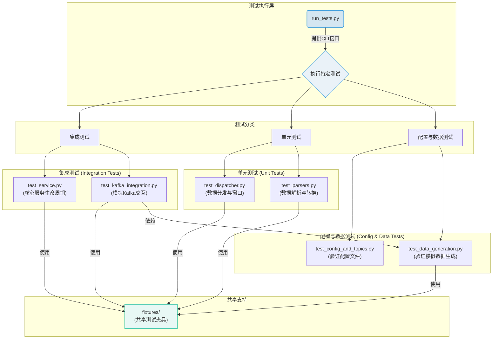

# 软件测试说明书

## 1. 引言

### 1.1 目的
本文档旨在详细说明 `data_analysis` 项目的测试策略、设计、范围和方法。其主要目标是确保代码的质量、稳定性和可维护性，通过系统化的测试流程，验证项目是否满足设计要求和业务需求。

### 1.2 项目背景
`data_analysis` 是一个用于实时数据处理和分析的系统，它从 Kafka 消费数据，经过一系列解析、聚合和模型计算，最终将结果输出。系统的核心在于其模块化的设计，允许灵活配置和扩展新的数据处理模型。

### 1.3 测试范围
本次测试覆盖 `d_a` 包内的所有核心功能模块，包括：
- **配置加载与验证** (`config.py`)
- **数据解析与转换** (`parsers/`, `topic_parsers/`)
- **数据分发与依赖处理** (`dispatcher.py`)
- **核心服务逻辑** (`analysis_service.py`, `service_base.py`)
- **Kafka 集成** (`kafka_client.py`)
- **批次结果聚合** (`batch_result_aggregator.py`)
- **辅助工具与错误处理**

## 2. 测试策略

### 2.1 测试层级
我们采用多层测试策略，以确保从底层单元到高层集成的全面覆盖。

- **单元测试 (Unit Tests)**: 针对最小可测试单元（如单个函数、类或方法）进行测试。重点关注输入输出的正确性、边界条件和异常处理。例如，测试单个 `parser` 是否能正确解析特定格式的数据。

- **集成测试 (Integration Tests)**: 测试多个模块协同工作的正确性。例如，验证 `AnalysisService` 是否能正确地从（模拟的）Kafka 接收消息，通过 `DataDispatcher` 聚合数据，并调用正确的处理回调。

- **端到端测试 (End-to-End Tests)**: 在接近生产的环境中，测试整个数据流。这包括启动一个真实的（或 Docker 化）的 Kafka 实例，运行模拟数据生产者，并验证 `AnalysisService` 是否能完整地处理数据并产生预期的输出。

### 2.2 测试类型

- **功能测试**: 验证软件是否满足需求规格说明书中定义的功能。
- **性能测试**: 评估系统在不同负载下的响应时间、吞吐量和资源利用率（当前版本暂未大规模覆盖）。
- **回归测试**: 在代码变更后，重新运行所有测试，确保新的修改没有破坏现有功能。

### 2.3 测试环境
- **开发环境**: 开发者本地机器，使用 `pytest` 进行快速的单元和集成测试。
- **CI/CD 环境**: 在持续集成服务器（如 Jenkins, GitHub Actions）上自动运行所有测试。测试环境将包含一个 Kafka 实例，以支持端到端测试。
- **操作系统**: Windows / Linux
- **Python 版本**: 3.9+
- **主要依赖**: `pytest`, `pytest-asyncio`, `confluent-kafka`

## 3. 测试软件架构

重构后的测试框架旨在提高模块化、可读性和可维护性。其核心思想是按功能对测试进行分组，使测试结构与 `d_a` 项目的逻辑架构保持一致。



- **`run_tests.py`**: 命令行测试工具，提供统一的测试入口，用于执行连接性检查、快速测试、模块化测试和模拟数据生产等预定义场景。

- **`test_config_and_topics.py`**: 专注于配置验证。它确保 `config.py` 中定义的所有 Topic、模块依赖和解析器映射都是正确和一致的。

- **`test_data_generation.py`**: 负责测试所有模拟数据的生成逻辑。它验证 `MockDataGenerator` 是否能为每个 Topic 创建符合预期格式和数据范围的测试数据。

- **`test_parsers.py`**: 包含所有数据解析器的单元测试。每个解析器（无论是 `topic_parsers` 还是 `parsers`）都在此进行隔离测试，以验证其数据转换和验证逻辑的正确性。

- **`test_dispatcher.py`**: 针对 `DataDispatcher` 的单元测试。重点验证数据缓存、时间窗口管理、数据对齐与填充，以及模块依赖输入的聚合逻辑。

- **`test_service.py`**: 对核心服务 `AsyncDataAnalysisService` 进行集成测试。它覆盖了服务的完整生命周期（启动、停止）、任务调度、健康状态监控和批次结果聚合 (`BatchResultAggregator`)。

- **`test_kafka_integration.py`**: 模拟 Kafka 环境，对服务与 Kafka 的交互进行集成测试。通过模拟的 `Consumer` 和 `Producer`，验证消息的消费、处理回调和结果上报流程，而无需真实的 Kafka 实例。

- **`fixtures/`**: 存放共享的测试夹具（Fixtures）和工具函数。例如，`pytest` 的 `fixture` 定义可以放在这里，供多个测试模块复用。

## 4. 测试设计

### 4.1 测试用例设计
测试用例的设计遵循以下原则：
- **清晰性**: 每个测试用例只关注一个特定的功能点。
- **独立性**: 测试用例之间不应有依赖关系。
- **可重复性**: 测试用例在任何环境中都应产生相同的结果。

### 4.2 核心模块测试设计

#### 4.2.1 `DataDispatcher`
- **数据缓存与过期**: 验证数据是否在指定时间后被正确清理。
- **数据对齐与填充**: 重点测试时序数据（特别是枪级数据）在窗口内是否能正确对齐和填充缺失值。
- **依赖满足**: 验证 `get_module_input` 是否能在所有依赖的 topic 数据都可用时才返回完整输入。
- **数据质量报告**: 验证 `_data_quality` 字段是否准确反映了数据的可用性。

#### 4.2.2 `AnalysisService` / `AsyncAnalysisService`
- **服务生命周期**: 测试 `start()` 和 `stop()` 方法能否正确启动和停止所有后台任务。
- **回调处理**: 验证服务是否能正确调用业务回调函数，并处理其返回值。
- **异常处理**: 测试当回调函数或内部组件抛出异常时，服务是否能捕获异常、记录日志并保持稳定运行。
- **结果上传**: 验证处理结果是否被正确格式化并发送到指定的 Kafka topic。
- **批次处理**: 验证 `BatchResultAggregator` 是否能正确收集来自多个场站的结果，并在超时或全部完成后统一上传。

#### 4.2.3 Parsers (`topic_parsers/` 和 `parsers/`)
- **有效数据解析**: 测试每个 parser 是否能正确解析其对应的 topic 数据。
- **无效数据处理**: 测试当输入数据缺少字段或格式错误时，parser 是否能优雅地处理（例如，返回 `None` 或使用默认值）。
- **窗口数据聚合**: 对于需要处理数据窗口的 parser，测试其 `parse_window` 方法是否能正确聚合多条记录。

#### 4.2.4 Kafka 集成
- **连接性**: 测试能否成功连接到 Kafka broker。
- **生产与消费**: 模拟生产者发送消息，验证消费者能否接收并正确反序列化。
- **Offset 管理**: 验证 offset 是否在处理完成后被正确提交。

## 5. 测试执行与报告

### 5.1 测试执行
测试使用 `pytest` 框架执行。开发者可以在本地通过以下命令运行测试：
```bash
# 运行所有测试
pytest tests/

# 运行特定文件的测试
pytest tests/test_dispatcher.py

# 运行包含特定关键字的测试
pytest -k "aggregation"
```
`run_tests.py` 脚本提供了更友好的命令行接口，用于执行特定场景的测试，如连接性检查、快速测试等。

### 5.2 测试报告
测试报告将由 `pytest` 自动生成。在 CI/CD 环境中，可以配置生成 HTML 格式的详细报告，并与代码覆盖率报告集成。

### 5.3 代码覆盖率
我们使用 `pytest-cov` 工具来衡量测试的代码覆盖率。目标是核心逻辑模块的覆盖率达到 90% 以上。
```bash
pytest --cov=d_a tests/
```

## 6. 缺陷管理
- **缺陷跟踪**: 所有在测试过程中发现的缺陷都将在项目的 Issue Tracker（如 GitHub Issues）中进行记录和跟踪。
- **缺陷报告**: 每个缺陷报告应包含以下信息：
  - 标题：简明扼要地描述问题。
  - 复现步骤：详细说明如何复现该问题。
  - 预期结果：描述在正常情况下应该发生什么。
  - 实际结果：描述实际发生了什么。
  - 环境信息：操作系统、Python 版本、相关库版本等。
- **缺陷修复**: 缺陷将根据其严重性和优先级进行修复。修复后，需要编写相应的回归测试用例，以防止问题再次出现。

```python
def generate_device_error(
    self,
    station_id: str,
    window_size: int = 10
) -> Dict[str, Any]
```

| 参数 | 类型 | 默认值 | 说明 |
|------|------|--------|------|
| station_id | str | - | 场站ID |
| window_size | int | 10 | 窗口大小 |

**返回值**: `Dict[str, Any]` - 设备错误数据窗口

**返回数据结构**:
```python
{
    "station_id": str,
    "host_error": List[int],        # 主机错误（0正常,1故障）
    "ac_error": List[int],          # AC错误
    "dc_error": List[int],          # DC错误
    "terminal_error": List[int],    # 终端错误
    "storage_error": List[int],     # 储能错误
    "timestamps": List[float]       # 时间戳（间隔60~600秒随机）
}
```

**时间间隔**: 60~600秒随机

**示例**:
```python
data = generator.generate_device_error("station_001", window_size=5)
total_errors = sum(data['host_error']) + sum(data['ac_error']) + sum(data['dc_error'])
print(f"总错误次数: {total_errors}")
```

#### 4.2.10 generate_device_host

生成主机数据窗口（1秒或15秒间隔）。

```python
def generate_device_host(
    self,
    host_id: str,
    window_size: int = 100
) -> Dict[str, Any]
```

| 参数 | 类型 | 默认值 | 说明 |
|------|------|--------|------|
| host_id | str | - | 主机ID |
| window_size | int | 100 | 窗口大小 |

**返回值**: `Dict[str, Any]` - 主机数据窗口

**返回数据结构**:
```python
{
    "host_id": str,
    "acdc_status": List[int],           # ACDC状态（0停机,1运行,2故障）
    "dcdc_input_power": List[float],    # DCDC输入功率（10.0~200.0kW）
    "acdc_input_power": List[float],    # ACDC输入功率（10.0~200.0kW）
    "timestamps": List[float]           # 时间戳（间隔1秒或15秒）
}
```

**时间间隔**: 1秒或15秒（随机选择）

**示例**:
```python
data = generator.generate_device_host("host_001", window_size=40)
avg_dcdc = sum(data['dcdc_input_power']) / len(data['dcdc_input_power'])
print(f"DCDC平均功率: {avg_dcdc:.2f}kW")
```

#### 4.2.11 generate_device_storage

生成储能数据窗口（15秒间隔）。

```python
def generate_device_storage(
    self,
    host_id: str,
    window_size: int = 100
) -> Dict[str, Any]
```

| 参数 | 类型 | 默认值 | 说明 |
|------|------|--------|------|
| host_id | str | - | 主机ID |
| window_size | int | 100 | 窗口大小 |

**返回值**: `Dict[str, Any]` - 储能数据窗口

**返回数据结构**:
```python
{
    "host_id": str,
    "storage_id": str,                  # 储能设备ID
    "storage_power": List[float],       # 功率（-100~100kW，负值放电，正值充电）
    "storage_current": List[float],     # 电流（-50~50A）
    "storage_temp_max": List[float],    # 最高温度（25~45°C）
    "storage_temp_min": List[float],    # 最低温度（20~35°C）
    "storage_SOC": List[float],         # SOC（20~100%）
    "storage_SOH": List[float],         # SOH健康度（85~100%）
    "timestamps": List[float]           # 时间戳（间隔15秒）
}
```

**时间间隔**: 15秒

**示例**:
```python
data = generator.generate_device_storage("host_001", window_size=40)
avg_soc = sum(data['storage_SOC']) / len(data['storage_SOC'])
avg_soh = sum(data['storage_SOH']) / len(data['storage_SOH'])
print(f"平均SOC: {avg_soc:.1f}%")
print(f"平均SOH: {avg_soh:.1f}%")
```

---

### 4.3 MockProducer 类 (test_mock_producer.py)

模拟Kafka生产者，持续发送测试数据到Kafka。

#### 4.3.1 类初始化

```python
MockProducer(
    kafka_config: Optional[Dict] = None,
    topic_detail: Optional[Dict] = None
)
```

| 参数 | 类型 | 默认值 | 说明 |
|------|------|--------|------|
| kafka_config | Optional[Dict] | None | Kafka配置，为None时使用KAFKA_CONFIG |
| topic_detail | Optional[Dict] | None | Topic详情配置，为None时使用TOPIC_DETAIL |

**实例属性**:

| 属性名 | 类型 | 说明 |
|--------|------|------|
| kafka_config | Dict | Kafka连接配置 |
| topic_detail | Dict | Topic详细信息 |
| generator | MockDataGenerator | 数据生成器实例 |
| producer | Optional[AsyncKafkaProducerClient] | Kafka生产者客户端 |
| running | bool | 运行状态标志 |

**示例**:
```python
from tests.test_mock_producer import MockProducer

# 使用默认配置
producer = MockProducer()

# 使用自定义配置
custom_config = {'bootstrap_servers': 'localhost:9092'}
producer = MockProducer(kafka_config=custom_config)
```

#### 4.3.2 start

启动生产者连接。

```python
async def start(self) -> None
```

**功能说明**:
- 创建AsyncKafkaProducerClient实例
- 建立与Kafka的连接
- 记录启动日志

**异常**: 连接失败时抛出异常

**示例**:
```python
producer = MockProducer()
await producer.start()
```

#### 4.3.3 stop

停止生产者并关闭连接。

```python
async def stop(self) -> None
```

**功能说明**:
- 设置running标志为False
- 关闭生产者连接
- 记录停止日志

**示例**:
```python
await producer.stop()
```

#### 4.3.4 produce_topic_data

发送单条topic数据。

```python
async def produce_topic_data(
    self,
    topic: str,
    data: Dict
) -> None
```

| 参数 | 类型 | 说明 |
|------|------|------|
| topic | str | 目标topic名称 |
| data | Dict | 要发送的数据字典 |

**功能说明**:
- 检查生产者是否已启动
- 使用producer.send()发送数据
- 记录发送日志（显示topic和数据键名）
- 失败时记录错误日志

**异常**: 生产者未启动时抛出RuntimeError

**示例**:
```python
data = generator.generate_station_param("station_001")
await producer.produce_topic_data("SCHEDULE-STATION-PARAM", data)
```

#### 4.3.5 run_continuous

持续运行指定时长，定期发送各topic数据。

```python
async def run_continuous(
    self,
    duration_seconds: int = 60,
    interval_seconds: int = 5
) -> None
```

| 参数 | 类型 | 默认值 | 说明 |
|------|------|--------|------|
| duration_seconds | int | 60 | 总运行时长（秒） |
| interval_seconds | int | 5 | 每次发送间隔（秒） |

**功能说明**:
- 设置running标志为True
- 在duration_seconds时长内循环运行
- 每隔interval_seconds发送一批数据
- 为每个场站生成和发送以下topic数据：
  - 场站参数（每10次迭代发送1次）
  - 场站实时数据（每次）
  - 订单数据（每次）
  - 电价数据（每20次迭代发送1次）
  - 设备错误（20%概率触发）
- 为每个主机生成和发送：
  - 主机数据（每次）
  - 充电枪数据（每次）
  - 储能数据（每次）
- 为每个电表生成和发送电表数据
- 环境日历（每30次迭代发送1次）
- 记录迭代次数和完成日志

**数据发送频率控制**:

| Topic | 发送频率 | 说明 |
|-------|----------|------|
| SCHEDULE-STATION-PARAM | 低频（每10次） | 配置类数据 |
| SCHEDULE-STATION-REALTIME-DATA | 每次 | 实时监控数据 |
| SCHEDULE-CAR-ORDER | 每次 | 订单数据 |
| SCHEDULE-CAR-PRICE | 低频（每20次） | 电价策略 |
| SCHEDULE-DEVICE-ERROR | 随机（20%） | 故障数据 |
| SCHEDULE-DEVICE-HOST | 每次 | 主机状态 |
| SCHEDULE-DEVICE-GUN | 每次 | 充电枪状态 |
| SCHEDULE-DEVICE-STORAGE | 每次 | 储能状态 |
| SCHEDULE-DEVICE-METER | 每次 | 电表数据 |
| SCHEDULE-ENVIRONMENT-CALENDAR | 低频（每30次） | 日历数据 |

**窗口大小**:
- 场站实时数据: 50个点
- 订单数据: 30个点
- 设备错误: 5个点
- 主机/枪/储能/电表: 40个点

**示例**:
```python
producer = MockProducer()
await producer.start()

# 运行5分钟，每10秒发送一批数据
await producer.run_continuous(
    duration_seconds=300,
    interval_seconds=10
)

await producer.stop()
```

**使用场景**:
- 长时间集成测试
- 性能压力测试
- 服务稳定性验证
- 数据流监控

**注意事项**:
- 必须先调用start()启动生产者
- 完成后应调用stop()释放资源
- interval_seconds不宜过小（建议≥5秒）
- duration_seconds应根据测试需求设置

---

### 4.4 测试入口函数 (run_tests.py)

命令行测试工具，提供统一的测试入口。

#### 4.4.1 main

主函数，解析命令行参数并执行相应测试。

```python
def main() -> None
```

**命令行参数**:

| 参数 | 类型 | 选项 | 说明 |
|------|------|------|------|
| test_type | 位置参数 | consume, produce, quick, module, connectivity | 测试类型 |
| --module | 可选 | 字符串 | 模块名称（默认: load_prediction） |
| --duration | 可选 | 整数 | 运行时长秒数（默认: 60） |
| --timeout | 可选 | 整数 | 超时时间秒数（默认: 20） |

**测试类型说明**:

1. **connectivity**: Kafka连接性测试
   ```bash
   python tests/run_tests.py connectivity
   ```
    - 调用run_kafka_connectivity()
   - 验证Kafka服务可访问性
   - 返回连接成功/失败状态

2. **quick**: 快速消费测试
   ```bash
   python tests/run_tests.py quick --timeout 30
   ```
   - 调用quick_test(timeout)
   - 测试前5个topic的消费
   - 适用于快速验证

3. **consume**: 完整消费测试
   ```bash
   python tests/run_tests.py consume
   ```
   - 调用test_kafka_consume.main()
   - 测试所有topic的消费
   - 生成详细报告

4. **module**: 模块特定topic测试
   ```bash
   python tests/run_tests.py module --module load_prediction --timeout 30
   ```
    - 调用run_module_topics(module_name)
   - 测试指定模块依赖的所有topic
   - 验证模块集成

5. **produce**: 模拟数据生产
   ```bash
   python tests/run_tests.py produce --duration 300
   ```
    - 实例化MockProducer并启动
    - 持续发送数据
   - 用于测试数据准备

**示例使用场景**:

```bash
# 场景1: 环境初次验证
python tests/run_tests.py connectivity

# 场景2: 开发中快速检查
python tests/run_tests.py quick --timeout 15

# 场景3: 完整功能测试
python tests/run_tests.py consume

# 场景4: 测试负载预测模块
python tests/run_tests.py module --module load_prediction

# 场景5: 准备测试数据（10分钟）
python tests/run_tests.py produce --duration 600
```

---

### 4.5 独立测试函数

位于`test_kafka_consume.py`中的全局测试函数。

#### 4.5.1 run_kafka_connectivity

测试Kafka服务连接性。

```python
async def run_kafka_connectivity() -> bool
```

**返回值**: `bool` - 连接是否成功

**功能说明**:
- 创建AsyncKafkaConsumerClient实例
- 尝试启动消费者连接
- 获取可用topic列表
- 显示连接状态和topic数量
- 关闭连接

**输出示例**:
```
Testing Kafka connectivity...
✓ Successfully connected to Kafka
Available topics: 10
  - SCHEDULE-STATION-PARAM
  - SCHEDULE-DEVICE-METER
  ...
```

**示例**:
```python
success = await run_kafka_connectivity()
if not success:
    print("Kafka服务不可用")
    sys.exit(1)
```

#### 4.5.2 quick_test

快速测试前N个topic。

```python
async def quick_test(timeout: int = 20, num_topics: int = 5) -> None
```

| 参数 | 类型 | 默认值 | 说明 |
|------|------|--------|------|
| timeout | int | 20 | 每个topic超时时间 |
| num_topics | int | 5 | 测试topic数量 |

**功能说明**:
- 从TOPIC_DETAIL中选取前num_topics个topic
- 使用TopicConsumeTester测试这些topic
- 打印汇总报告

**示例**:
```python
# 快速测试前3个topic，每个超时15秒
await quick_test(timeout=15, num_topics=3)
```

#### 4.5.3 run_module_topics

测试特定模块的所有依赖topic。

```python
async def run_module_topics(module_name: str, timeout_per_topic: int = 20) -> None
```

| 参数 | 类型 | 说明 |
|------|------|------|
| module_name | str | 模块名称（如'load_prediction'） |
| timeout_per_topic | int | 每个topic的超时时长（秒） |

**功能说明**:
- 从MODULE_TO_TOPICS获取模块依赖的topic列表
- 使用TopicConsumeTester测试所有topic
- 打印测试结果

**支持的模块**:
- load_prediction: 负载预测
- operation_optimization: 运行优化
- thermal_management: 热管理

**示例**:
```python
await run_module_topics("load_prediction")
```

#### 4.5.4 main (test_kafka_consume.py)

完整的消费测试主函数。

```python
async def main(timeout_per_topic: int = 20, module_name: str = "load_prediction") -> None
```

**功能说明**:
1. 测试Kafka连接性
2. 根据timeout_per_topic测试所有配置topic
3. 针对module_name执行模块topic与服务集成验证
4. 打印详细汇总报告

**示例**:
```python
asyncio.run(main())
```

---

## 5. 测试用例说明

### 5.1 单元测试

#### 5.1.1 test_dispatcher.py

**测试目标**: DataDispatcher数据窗口管理

**测试用例**:

1. **test_window_padding**
   - 验证窗口数据补全功能
   - 测试不足窗口长度时的填充策略
   - 断言: `len(result['current_power_window']) == win_size`

2. **test_expired_clean**
   - 验证过期数据清理功能
   - 测试数据过期后自动删除
   - 断言: `station_id not in dispatcher.data_cache`

**关键代码**:
```python
def test_window_padding():
    dispatcher = DataDispatcher(data_expire_seconds=60)
    station_id = 'test_station'
    topic = 'SCHEDULE-DEVICE-METER'
    
    # 插入少量数据
    for i in range(3):
        dispatcher.update_topic_data(
            station_id, topic,
            {'meter_id': 1, 'current_power': i, 'rated_power_limit': 10}
        )
    
    # 获取模块输入，验证窗口补全
    result = dispatcher.get_module_input(station_id, 'operation_optimization')
    assert 'current_power_window' in result
```

#### 5.1.2 test_dispatcher_padding.py

**测试目标**: 数据补全策略

**补全策略说明**:

| 策略 | 说明 | 适用场景 |
|------|------|----------|
| `zero` | 零填充 | 默认策略，简单快速 |
| `linear` | 线性插值 | 连续数值数据 |
| `forward` | 前向填充 | 保持最后有效值 |
| `missing` | None标记 | 明确标识缺失 |

**测试用例**:

1. **test_zero_padding**
   ```python
   # 输入: [1, 2], 目标长度: 5
   # 输出: [0, 0, 0, 1, 2]
   ```

2. **test_linear_padding**
   ```python
   # 输入: [1, 3], 目标长度: 4
   # 输出: [1.0, 1.67, 2.33, 3.0] (线性插值)
   ```

3. **test_forward_padding**
   ```python
   # 输入: [5], 目标长度: 3
   # 输出: [5, 5, 5]
   ```

4. **test_missing_padding**
   ```python
   # 输入: [], 目标长度: 2
   # 输出: [None, None]
   ```

#### 5.1.3 test_dependency.py

**测试目标**: 模块间依赖关系处理

**依赖关系图**:

```
load_prediction
    ↓
operation_optimization
    ↑
thermal_management
```

**测试用例**:

1. **test_dependency_aggregation**
   - 验证依赖模块的输出聚合
   - 测试字段级联传递
   - 断言依赖字段存在于结果中

#### 5.1.4 test_mock_data_generator.py

**测试目标**: 数据生成器功能验证

**测试覆盖**:

- ✅ 所有10个topic的数据生成
- ✅ 窗口大小配置
- ✅ 数据范围验证
- ✅ 时间戳递增验证
- ✅ 多场站数据生成

**关键测试**:

```python
def test_station_realtime_data_generation():
    generator = MockDataGenerator()
    window_size = 50
    data = generator.generate_station_realtime_data(
        "test_station", window_size
    )
    
    # 验证窗口长度
    assert len(data["history_curve_station_avg"]) == window_size
    
    # 验证时间戳递增
    timestamps = data["timestamps"]
    for i in range(1, len(timestamps)):
        assert timestamps[i] > timestamps[i-1]
```

### 5.2 集成测试

#### 5.2.1 test_async_service.py

**测试目标**: 异步服务完整流程

**测试流程**:

```
1. 创建AsyncDataAnalysisService
2. Mock Kafka Consumer/Producer
3. 注入测试消息
4. 启动服务并设置回调
5. 验证回调执行
6. 验证结果上传
7. 停止服务
```

**关键断言**:

```python
assert service.producer.sent  # 验证数据已上传
assert service.get_station_status()['S']['running'] is False  # 验证状态
```

#### 5.2.2 test_kafka_upload.py

**测试目标**: Kafka结果上传功能

**测试步骤**:

1. Mock KafkaProducerClient.send方法
2. 启动DataAnalysisService
3. 模拟数据输入
4. 触发回调返回结果
5. 验证上传的topic和数据格式

#### 5.2.3 test_integration_extra.py

**测试目标**: 扩展集成功能

**测试用例**:

1. **test_health_monitoring**
   - 验证服务健康状态监控
   - 测试场站任务状态查询
   - 断言状态字段完整性

2. **test_reload_config**
   - 验证配置热更新功能
   - 测试运行时配置变更
   - 断言配置生效

3. **test_async_add_remove_station**
   - 验证动态添加/移除场站
   - 测试异步任务管理
   - 断言任务正确启停

#### 5.2.4 test_extreme_and_integration.py

**测试目标**: 边界条件和异常处理

**极端场景测试**:

1. **空数据窗口**
   ```python
   @pytest.mark.parametrize("padding, seq, target", [
       ('zero', [], 3),
       ('linear', [], 2),
   ])
   ```

2. **无效Topic**
   ```python
   dispatcher.update_topic_data('sid', 'INVALID_TOPIC', {'x': 1})
   # 应该捕获异常，不抛出
   ```

3. **回调异常**
   ```python
   async def bad_cb(station_id, module_input):
       raise ValueError("test error")
   # 服务应继续运行，不崩溃
   ```

4. **真实Kafka集成**
   ```python
   # 检测本地Kafka服务
   if not kafka_port_open():
       pytest.skip("Kafka未运行")
   # 进行真实的生产消费测试
   ```

---

## 6. 使用指南

### 6.1 快速开始

#### 6.1.1 环境准备

```bash
# 1. 克隆项目
git clone <repository>
cd data_analysis

# 2. 安装依赖
pip install -r requirements.txt

# 3. 配置Kafka
# 编辑 d_a/config.py，设置bootstrap_servers
```

#### 6.1.2 运行测试

**方式1: 使用便捷脚本（推荐）**

```bash
# 验证环境
python tests/run_tests.py connectivity

# 快速测试
python tests/run_tests.py quick

# 完整测试
python tests/run_tests.py consume
```

**方式2: 使用pytest**

```bash
# 运行所有单元测试
pytest tests/test_dispatcher.py -v
pytest tests/test_dependency.py -v

# 运行特定测试
pytest tests/test_dispatcher.py::test_window_padding -v

# 运行异步测试
pytest tests/test_async_service.py -v
```

**方式3: 直接运行测试文件**

```bash
pytest tests/test_kafka_consume.py -v
pytest tests/test_mock_producer.py -v
```

### 6.2 开发流程测试

#### 6.2.1 新功能开发

```bash
# 1. 启动模拟生产者（终端1）
python tests/run_tests.py produce --duration 600

# 2. 开发调试（终端2）
python d_a/main.py

# 3. 测试验证（终端3）
python tests/run_tests.py module --module <your_module>
```

#### 6.2.2 Bug修复验证

```bash
# 1. 编写针对性测试用例
# tests/test_bugfix_xxx.py

# 2. 运行测试验证Bug存在
pytest tests/test_bugfix_xxx.py -v

# 3. 修复代码

# 4. 再次运行测试验证修复
pytest tests/test_bugfix_xxx.py -v
```

#### 6.2.3 集成测试

```python
# tests/test_custom_integration.py
import asyncio
from tests.test_mock_producer import MockProducer
from tests.test_kafka_consume import TopicConsumeTester

async def integration_test():
    # 启动生产者
    producer = MockProducer()
    await producer.start()
    producer_task = asyncio.create_task(
        producer.run_continuous(60, 5)
    )
    
    # 等待数据生成
    await asyncio.sleep(10)
    
    # 测试消费
    tester = TopicConsumeTester()
    results = await tester.test_all_topics_async(
        list(TOPIC_DETAIL.keys()),
        timeout_per_topic=15
    )
    
    tester.print_summary()
    await producer_task
    await producer.stop()

asyncio.run(integration_test())
```


## 7. 配置说明

### 7.1 Kafka配置

**配置文件**: `d_a/config.py`

**核心配置项**:

```python
KAFKA_CONFIG = {
    'bootstrap_servers': ['10.8.4.40:35888'],  # Kafka服务器地址
    'consumer': {
        'group_id': 'stack-charge-tcp-command',  # 消费者组ID
        'auto_offset_reset': 'latest',  # 偏移量重置策略
        'enable_auto_commit': False,     # 手动提交偏移量
        'max_poll_records': 3000,        # 单次poll最大记录数
    },
    'producer': {
        # 生产者配置
    }
}
```

**偏移量策略**:

| 策略 | 说明 | 适用场景 |
|------|------|----------|
| `latest` | 从最新消息开始 | 生产环境，只关注新数据 |
| `earliest` | 从最早消息开始 | 测试环境，需要历史数据 |

**测试时修改**:

```python
# 临时修改配置进行测试
test_config = {
    'bootstrap_servers': ['localhost:9092'],
    'consumer': {
        'group_id': 'test-group',
        'auto_offset_reset': 'earliest',  # 读取历史数据
    }
}

tester = TopicConsumeTester(kafka_config=test_config)
```

### 7.2 Topic配置

**配置位置**: `d_a/config.py` -> `TOPIC_DETAIL`

**配置结构**:

```python
TOPIC_DETAIL = {
    'TOPIC_NAME': {
        'fields': ['field1', 'field2', ...],  # 字段列表
        'frequency': '更新频率描述',            # 更新频率
        'modules': ['module1', 'module2'],    # 使用该topic的模块
        'window_size': 100,                   # 窗口大小
    }
}
```

**示例**:

```python
'SCHEDULE-STATION-REALTIME-DATA': {
    'fields': [
        'station_id', 'gun_id',
        'history_curve_gun_avg',
        'history_curve_gun_max',
        'history_curve_station_avg',
        'history_curve_station_max'
    ],
    'frequency': '1小时1次，推送7天',
    'modules': [
        'load_prediction',
        'operation_optimization',
        'electricity_price',
        'SOH_model',
        'thermal_management',
        'evaluation_model'
    ],
    'window_size': 7*24  # 7天×24小时
}
```

### 7.3 模块依赖配置

**配置位置**: `d_a/config.py` -> `MODULE_DEPENDENCIES`

```python
MODULE_DEPENDENCIES = {
    'electricity_price': ['pv_prediction', 'evaluation_model', 'SOH_model'],
    'station_guidance': ['load_prediction', 'evaluation_model'],
    'thermal_management': ['load_prediction', 'operation_optimization'],
    'operation_optimization': ['load_prediction'],
}
```

**依赖关系说明**:

- Key: 目标模块
- Value: 依赖的上游模块列表
- 系统自动聚合上游输出到目标模块输入

### 7.4 测试参数配置

**TopicConsumeTester参数**:

```python
tester = TopicConsumeTester(
    kafka_config=custom_config  # 自定义Kafka配置
)
```

**测试超时配置**:

```python
# 单个topic超时
await tester.test_single_topic_async(
    "TOPIC_NAME",
    timeout_seconds=30  # 30秒超时
)

# 批量测试超时
await tester.test_all_topics_async(
    topics,
    timeout_per_topic=20  # 每个topic 20秒
)
```

**服务集成测试配置**:

```python
result = await tester.test_service_integration(
    module_name="load_prediction",
    duration_seconds=60  # 运行60秒
)
```

**MockProducer配置**:

```python
producer = MockProducer(
    kafka_config=custom_config,  # Kafka配置
    topic_detail=custom_topics   # Topic配置
)

await producer.run_continuous(
    duration_seconds=300,  # 运行时长
    interval_seconds=10    # 发送间隔
)
```

---


## 8. 最佳实践

### 8.1 测试编写规范

#### 8.1.1 命名规范

```python
# 测试文件: test_<module_name>.py
test_dispatcher.py
test_kafka_consume.py

# 测试函数: test_<what_it_tests>
def test_window_padding():
    pass

def test_expired_clean():
    pass

# 测试类: Test<ClassName>
class TestDispatcher:
    def test_update_data(self):
        pass
```

#### 8.1.2 测试结构

```python
def test_feature():
    # 1. Arrange: 准备测试数据和环境
    dispatcher = DataDispatcher()
    station_id = "test_station"
    test_data = {"field": "value"}
    
    # 2. Act: 执行被测试的操作
    dispatcher.update_topic_data(station_id, "TOPIC", test_data)
    result = dispatcher.get_module_input(station_id, "module")
    
    # 3. Assert: 验证结果
    assert result is not None
    assert "field" in result
    
    # 4. Cleanup: 清理资源（如需要）
    dispatcher.clean_expired()
```

#### 8.1.3 使用Fixtures

```python
import pytest

@pytest.fixture
def dispatcher():
    """提供预配置的dispatcher实例"""
    d = DataDispatcher(data_expire_seconds=60)
    yield d
    # 清理代码（如需要）

@pytest.fixture
def test_data():
    """提供测试数据"""
    return {
        "station_id": "test_001",
        "value": 123
    }

def test_with_fixtures(dispatcher, test_data):
    dispatcher.update_topic_data(
        test_data["station_id"],
        "TOPIC",
        test_data
    )
    assert dispatcher.get_topic_window(
        test_data["station_id"],
        "TOPIC"
    )
```

### 8.2 测试覆盖率

#### 8.2.1 运行覆盖率测试

```bash
# 安装coverage工具
pip install pytest-cov

# 运行测试并生成覆盖率报告
pytest tests/ --cov=d_a --cov-report=html --cov-report=term

# 查看HTML报告
# 打开 htmlcov/index.html
```

#### 8.2.2 目标覆盖率

| 组件 | 目标覆盖率 | 当前状态 |
|------|-----------|---------|
| Dispatcher | 90% | ✅ |
| Service | 85% | ✅ |
| Parser | 80% | ✅ |
| Kafka Client | 75% | ⚠️ |

### 8.3 持续集成最佳实践

#### 8.3.1 分层测试策略

```yaml
# 快速测试（每次提交）
- 单元测试
- 静态代码分析
- 代码格式检查

# 完整测试（Pull Request）
- 单元测试
- 集成测试
- 代码覆盖率检查

# 全面测试（发布前）
- 所有测试
- 性能测试
- 压力测试
- 端到端测试
```

#### 8.3.2 测试数据管理

```python
# 使用固定的测试数据集
TEST_STATIONS = ["station_001", "station_002", "station_003"]
TEST_TOPICS = [
    "SCHEDULE-STATION-PARAM",
    "SCHEDULE-STATION-REALTIME-DATA"
]

# 版本化测试数据
# tests/fixtures/v1.0/
#   - station_data.json
#   - realtime_data.json
```

### 8.4 性能测试

#### 8.4.1 基准测试

```python
import time
import statistics

def benchmark_dispatcher():
    dispatcher = DataDispatcher()
    times = []
    
    for _ in range(1000):
        start = time.time()
        dispatcher.update_topic_data(
            "station_001",
            "TOPIC",
            {"value": 1}
        )
        times.append(time.time() - start)
    
    print(f"平均耗时: {statistics.mean(times)*1000:.2f}ms")
    print(f"P95: {statistics.quantiles(times, n=20)[18]*1000:.2f}ms")
    print(f"P99: {statistics.quantiles(times, n=100)[98]*1000:.2f}ms")
```

#### 8.4.2 压力测试

```python
async def stress_test():
    """并发场站压力测试"""
    service = AsyncDataAnalysisService()
    
    # 模拟1000个场站
    stations = [f"station_{i:04d}" for i in range(1000)]
    
    async def callback(station_id, module_input):
        return {"result": "ok"}
    
    await service.start(callback=callback)
    
    # 添加所有场站
    for sid in stations:
        await service.add_station(sid)
    
    # 运行10分钟
    await asyncio.sleep(600)
    
    # 统计
    status = service.get_station_status()
    print(f"活跃场站: {len([s for s in status.values() if s['running']])}")
    
    await service.stop()
```

### 8.5 测试文档

#### 8.5.1 文档字符串

```python
def test_complex_feature():
    """
    测试复杂功能的边界条件。
    
    测试场景:
    1. 正常情况: 完整数据输入
    2. 边界情况: 空数据输入
    3. 异常情况: 非法数据输入
    
    预期结果:
    - 正常情况返回正确结果
    - 边界情况返回默认值
    - 异常情况抛出特定异常
    
    已知限制:
    - 不支持超大窗口(>10000)
    
    相关Issue: #123, #456
    """
    pass
```

#### 8.5.2 测试报告

定期生成测试报告:

```bash
# 生成JUnit格式报告
pytest tests/ --junit-xml=test-results.xml

# 生成HTML报告
pytest tests/ --html=test-report.html --self-contained-html

# 集成到CI系统
# 配置CI自动上传测试报告到Dashboard
```

---

## 附录

### A. 测试文件清单

| 文件 | 类型 | 说明 | 优先级 |
|------|------|------|-------|
| run_tests.py | 工具 | 统一测试入口 | ⭐⭐⭐ |
| test_kafka_consume.py | 工具 | Kafka消费测试 | ⭐⭐⭐ |
| test_mock_producer.py | 工具 | 模拟数据生产 | ⭐⭐⭐ |
| test_dispatcher.py | 单元测试 | Dispatcher功能 | ⭐⭐⭐ |
| test_dependency.py | 单元测试 | 依赖关系 | ⭐⭐ |
| test_dispatcher_padding.py | 单元测试 | 数据补全 | ⭐⭐ |
| test_mock_data_generator.py | 单元测试 | 数据生成器 | ⭐⭐ |
| test_async_service.py | 集成测试 | 异步服务 | ⭐⭐⭐ |
| test_kafka_upload.py | 集成测试 | Kafka上传 | ⭐⭐ |
| test_integration_extra.py | 集成测试 | 扩展功能 | ⭐⭐ |
| test_extreme_and_integration.py | 集成测试 | 边界条件 | ⭐⭐ |

### B. 快速参考

#### B.1 常用命令

```bash
# 连接测试
python tests/run_tests.py connectivity

# 快速测试
python tests/run_tests.py quick

# 模块测试
python tests/run_tests.py module --module load_prediction

# 生产数据
python tests/run_tests.py produce --duration 120

# 单元测试
pytest tests/test_dispatcher.py -v

# 覆盖率测试
pytest tests/ --cov=d_a --cov-report=term
```

#### B.2 配置文件位置

```
d_a/config.py               # 主配置文件
  ├── KAFKA_CONFIG          # Kafka配置
  ├── TOPIC_DETAIL          # Topic配置
  ├── MODULE_DEPENDENCIES   # 依赖关系
  └── MODULE_OUTPUT_TOPICS  # 输出映射
```

#### B.3 重要类和函数

```python
# 测试工具
TopicConsumeTester          # Kafka消费测试
MockDataGenerator           # 数据生成器
MockProducer               # 模拟生产者

# 测试函数
run_kafka_connectivity()   # 连接测试
quick_test()               # 快速测试
run_module_topics()       # 模块测试
test_service_integration() # 集成测试
```

### C. 版本历史

| 版本 | 日期 | 变更内容 |
|------|------|----------|
| 1.0 | 2025-11-06 | 初始版本，包含完整测试套件 |
| 1.1 | 2025-11-10 | 添加覆盖率报告，优化测试数据管理 |
| 1.2 | 2025-11-15 | 增加性能测试，更新文档结构 |
| 1.3 | 2025-11-20 | 优化测试报告，添加基准测试 |
| 1.4 | 2025-11-25 | 完善文档字符，增加测试文档 |

---

## 附录：API函数索引

### 消费测试相关
- `TopicConsumeTester.__init__()` - 初始化消费测试器
- `TopicConsumeTester.test_single_topic_async()` - 异步测试单个topic
- `TopicConsumeTester.test_single_topic_sync()` - 同步测试单个topic  
- `TopicConsumeTester.test_all_topics_async()` - 异步批量测试
- `TopicConsumeTester.test_all_topics_sync()` - 同步批量测试
- `TopicConsumeTester.test_service_integration()` - 服务集成测试
- `TopicConsumeTester.print_summary()` - 打印测试报告
- `run_kafka_connectivity()` - 测试Kafka连接
- `quick_test()` - 快速测试
- `run_module_topics()` - 模块topic测试

### 数据生成相关
- `MockDataGenerator.__init__()` - 初始化数据生成器
- `MockDataGenerator.generate_station_param()` - 场站参数
- `MockDataGenerator.generate_station_realtime_data()` - 场站实时数据
- `MockDataGenerator.generate_environment_calendar()` - 环境日历
- `MockDataGenerator.generate_device_meter()` - 电表数据
- `MockDataGenerator.generate_device_gun()` - 充电枪数据
- `MockDataGenerator.generate_car_order()` - 订单数据
- `MockDataGenerator.generate_car_price()` - 电价数据
- `MockDataGenerator.generate_device_error()` - 设备错误
- `MockDataGenerator.generate_device_host()` - 主机数据
- `MockDataGenerator.generate_device_storage()` - 储能数据

### 数据生产相关
- `MockProducer.__init__()` - 初始化生产者
- `MockProducer.start()` - 启动生产者
- `MockProducer.stop()` - 停止生产者
- `MockProducer.produce_topic_data()` - 发送单条数据
- `MockProducer.run_continuous()` - 持续运行

### 测试入口
- `run_tests.main()` - 命令行入口函数

---

**文档结束**

*本说明书包含完整的测试工具文档和API接口详解*  
*版本: 1.0 | 最后更新: 2025-11-24*
